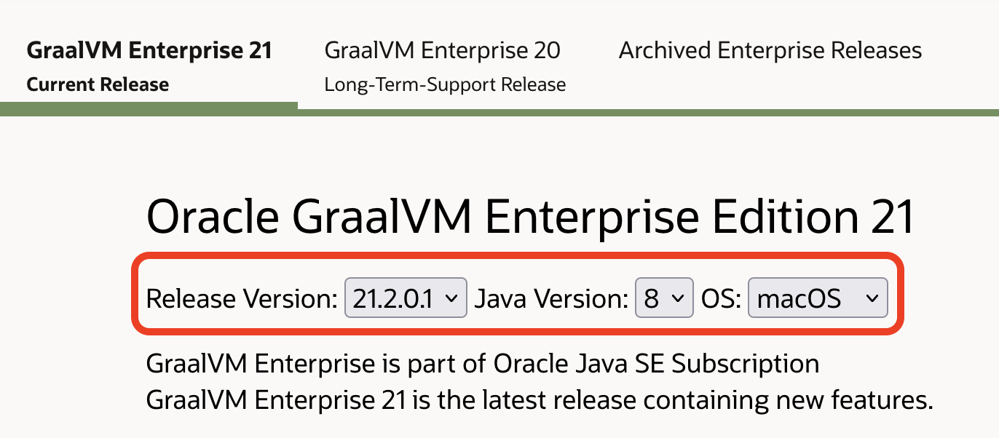
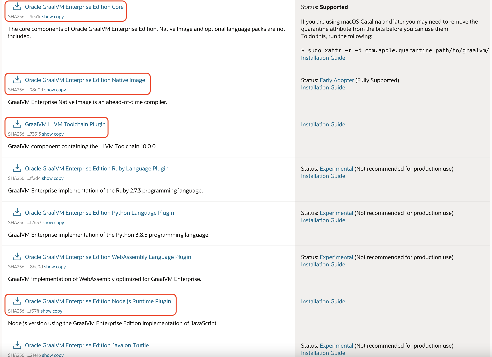
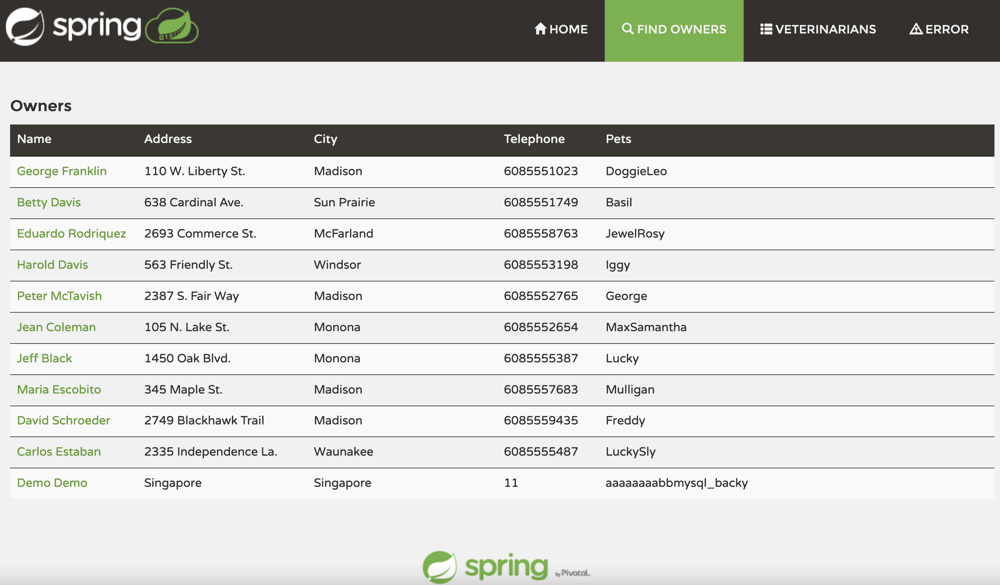
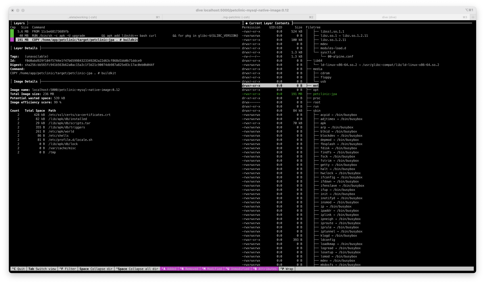
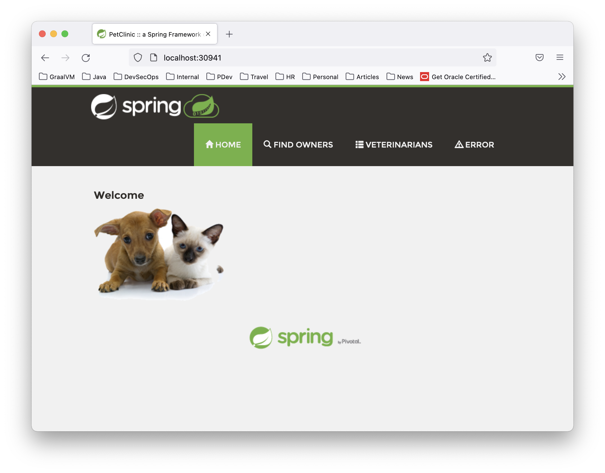
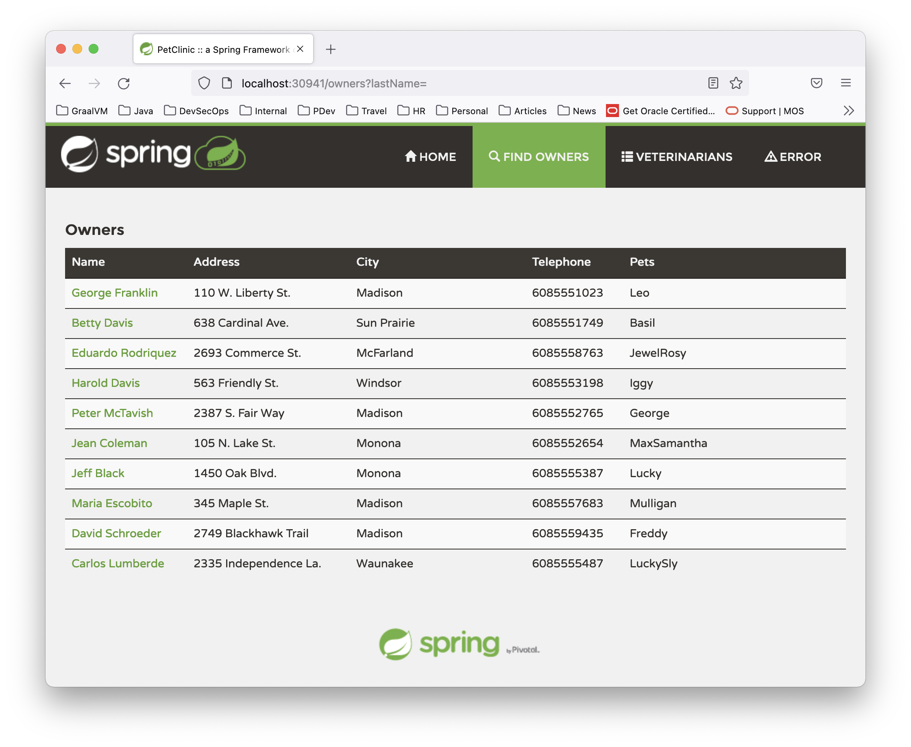

# GraalVM Hands-on Lab
_August 2021_

Table of Contents:

* **[Exercise 1: Requirements](#exercise-1-requirements)**
* **[Exercise 2: GraalVM Enterprise](#exercise-2-graalvm-enterprise)**
   * [Exercise 2.1: Setup GraalVM Enterprise Edition](#exercise-21-setup-graalvm-enterprise-edition)
   * [Exercise 2.2: High-performance modern JIT compiler for Java](#exercise-22-high-performance-modern-jit-compiler-for-java)
   * [Exercise 2.3: Ahead-of-Time (AOT) Compiler for Java Bytecode](#exercise-23-ahead-of-time-aot-compiler-for-java-bytecode)
   * [Exercise 2.4: Polyglot - Combine JavaScript, Java, and R](#exercise-24-polyglot---combine-javascript-java-and-r)
* **[Exercise 3: Microservices](#exercise-3-microservices)**
   * [Exercise 3.1: Creating native image inside Docker](#exercise-31-creating-native-image-inside-docker)
   * [Exercise 3.2: Sending a request to the application](#exercise-32-sending-a-request-to-the-application)
* **[Exercise 4: SpringBoot](#exercise-4-springboot)**
   * [Exercise 4.1: Clone the sample SpringBoot Application](#exercise-41-clone-the-sample-springboot-application)
   * [Exercise 4.2: Compile and run the application using GraalVM Native Image](#exercise-42-compile-and-run-the-application-using-graalvm-native-image)
   * [Exercise 4.3: Creating Docker Image](#exercise-41-clone-the-sample-springboot-application)
   * [Exercise 4.4: Deploy it to Kubernetes cluster](#exercise-42-compile-and-run-the-application-using-graalvm-native-image)


# Exercise 1: Requirements

In order to get yourself ready for this workshop, you need to prepare your machine/laptop to have the following requirements.

  * The supported OSes for this workshop are MacOS and Linux. Windows is supported by GraalVM but for this workshop we do not use Windows. This hands-on labs exercise have been tested with Oracle Linux 8.2, Ubuntu 20.04, Fedora 32 (with minor tweak due to CGroup v2 issue - see the workaround at the later part of this hands-on labs), MacOS Catalina 10.15.6 and MacOS BigSur 11.5.1.
  * Install the following tools : `git`, `curl`, `unzip`, `Docker`, `Apache Maven` and `your favourite IDE` (optional).
  * Internet connection. You will need to access some online Github repositories during workshop exercises.
  * Uninstall any JDK/OpenJDK that comes with the OS. Example Fedora 32 comes with OpenJDK 8.
    * On Fedora 32 execute ```sudo rpm -qa | grep java``` or ```sudo rpm -qa | grep jdk```, the output is something like (could be different from your machine) ```java-1.8.0-openjdk.x86_64``` and    uninstall using ```sudo yum remove java-1.8.0-openjdk.x86_64```.
  * You also need to install Docker and deploy local Docker Container Registry to try exercise 3 and 4.
  * You might also need to deploy local Kubernetes cluster for exercise 4.


# Exercise 2: GraalVM Enterprise

There are a lot of different parts to GraalVM, so while you may have heard of it, there are almost certainly things that it can do that you don't know about yet. In this workshop we'll go through some of the diverse features of GraalVM and show you what they can do for you.

In this workshop we will be using GraalVM Enterprise Edition 21.2.0.1 for JDK 8 which can be downloaded from [OTN - Oracle Technology Network](https://www.oracle.com/downloads/graalvm-downloads.html)

#### **_Important_** :

Everytime you see red computer icon  it means a command that you literally need to type from within your terminal.

## Exercise 2.1: Setup GraalVM Enterprise Edition

Below are the steps to setup **GraalVM Enterprise Edition 21.2.0.1 for JDK 8** which is the latest GraalVM version at the time I wrote this workshop materials.

* a) In order to get started with GraalVM Enterprise Edition, you will need to download it from [OTN - Oracle Technology Network](https://www.oracle.com/downloads/graalvm-downloads.html), make sure to choose "GraalVM Enterprise Edition 20 Current Release" tab as seen from below picture.

  

* b) Select Release Version 21.2.0.1, Java Version 8, and your OS (operating system) type.
If you are using MacOS (like I do), you can choose macOS for the OS. Another supported OS is Windows and Linux.
For this workshop we are only use either macOS or Linux. Windows has lesser features right now, therefore we don't use it now.

  

* c) Once you selected the OS, you can download 3 GraalVM components from OTN.

  1.  Oracle GraalVM Enterprise Edition Core
  2.  Oracle GraalVM Enterprise Edition Native Image
  3.  GraalVM LLVM Toolchain Plugin
  4.  Oracle GraalVM Enterprise Edition Node.js Runtime Plugin

  Beside the above 3 components we also need _GraalVM R Language Plugin_ component for this workshop.

  You can't download _GraalVM R Language Plugin_ from OTN, but you can install it online using ```gu``` utility.

  We will install it at later part of this workshop material.

  
  Optionally, you can also download Oracle GraalVM Enterprise Edition Python Language Plugin, Oracle GraalVM Enterprise Edition Ruby Language Plugin and Oracle GraalVM Enterprise Edition WebAssembly Language Plugin. But they are not required for this workshop.

   You need to login to OTN to be able to download the binaries. If you have an existing Oracle credential you can use it, but if not you can create one as seen from the following picture.

  

* d) Once downloaded successfully, you can extract it out using below commands

  * On MacOS

    
    >```sh
    >tar -zxf graalvm-ee-java8-darwin-amd64-21.2.0.1.tar.gz
    >```

  * On Linux

     
     >```sh
     >tar -zxf graalvm-ee-java8-linux-amd64-21.2.0.1.tar.gz
     >```

* e) It will create a new directory named "graalvm-ee-java8-21.2.0.1". Move it to any path that you want for example for MacOS I used to put it under ```/Library/Java/JavaVirtualMachines/```, or on Linux you can put it under ```/opt/```. This is will become your GraalVM installation directory.

  * On MacOS

    
    >```sh
    >sudo mv graalvm-ee-java8-21.2.0.1 /Library/Java/JavaVirtualMachines/.
    >```

    So, your GraalVM installation directory on MacOS is ```/Library/Java/JavaVirtualMachines/graalvm-ee-java8-21.2.0.1/Contents/Home```

  * On Linux

     
     >```sh
     >sudo mv graalvm-ee-java8-21.2.0.1 /opt/.
     >```

     And then your GraalVM installation directory on Linux is ```/opt/graalvm-ee-java8-21.2.0.1```

* f) Modify your terminal shell accordingly. Open your terminal and based on your shell type bash/zsh do the following.

  * On MacOS

    

    for zsh:
    >```sh
    > vi ~/.zshrc
    >```

    for bash:
    >```sh
    > vi ~/.bashrc
    >```

    and add the following to ```~/.zshrc``` or ```~/.bashrc``` files:

    >```sh
    >export GRAALVM_HOME=/Library/Java/JavaVirtualMachines/graalvm-ee-java8-21.2.0.1/Contents/Home
    >export PATH=$PATH:$GRAALVM_HOME/bin
    >```

    Save it, and then source using the following command:

    

    for zsh:
    >```sh
    > source ~/.zshrc
    >```

    for bash:
    >```sh
    > source ~/.bashrc
    >```

  * On Linux

    The same steps like MacOS above, except the ```GRAALVM_HOME``` directory is slightly different

    
    >```sh
    >export GRAALVM_HOME=/opt/graalvm-ee-java8-21.2.0.1
    >export PATH=$PATH:$GRAALVM_HOME/bin
    >```

    Save it, and source it (see the above MacOS step).

* g) That's it. You have just installed GraalVM on your MacOS or Linux machine. Next 2 steps are verifying the GraalVM installation and then setup Native Image, LLVM toolchain and R components.

* h) Verifying GraalVM installation.

  You can verify that the GraalVM versions will be used with the following commands:

  
  >```sh
  >java -version
  >```

  Should output:

  ```
  java version "1.8.0_301"
  Java(TM) SE Runtime Environment (build 1.8.0_301-b09)
  Java HotSpot(TM) 64-Bit Server VM GraalVM EE 21.2.0.1 (build 25.301-b09-jvmci-21.2-b08, mixed mode)
  ```

  Verify GraalVM JavaScript version

  
  >```sh
  >js --version
  >```

  Should output:

  ```
  GraalVM JavaScript (GraalVM EE Native 21.2.0.1)
  ```

* i) The final step of the setup is to install Native Image, LLVM toolchain, and R using GraalVM Utility ```gu```

   * On MacOS / Linux

      Assuming your default download directory is ```~/Downloads/```, you can run the following commands:

    
    >```sh
    >gu install -L ~/Downloads/native-image-installable-svm-svmee-java8-darwin-amd64-21.2.0.1.jar
    >gu install -L ~/Downloads/llvm-toolchain-installable-java8-darwin-amd64-21.2.0.1.jar
    >gu install -L ~/Downloads/nodejs-installable-svm-svmee-java8-darwin-amd64-21.2.0.1.jar
    >gu install R
    >```

    **Configure FastR**

    After installing FastR component using ```gu install R``` which will download R binary file from github, you are encourage to configure it.
    Below is how you do it on MacOS and Linux:

    On Linux

    
    >```sh
    >/opt/graalvm-ee-java8-20.1.0/jre/languages/R/bin/configure_fastr
    >```

    On MacOS

    
    >```sh
    >/Library/Java/JavaVirtualMachines/graalvm-ee-java8-20.1.0/Contents/home/jre/languages/R/bin/configure_fastr
    >```

    The output is something like the following:

    On Linux

    ```
    The basic configuration of FastR was successfull.

    Note: if you intend to install R packages you may need additional dependencies.
    The following packages should cover depenedencies of the most commonly used R packages:
    On Debian based systems: apt-get install build-essential gfortran libxml2 libc++-dev
    On Oracle Linux: yum groupinstall 'Development Tools' && yum install gcc-gfortran

    Default personal library directory (/home/mluther/R/x86_64-pc-linux-gnu-library/fastr-20.1.0-3.6) does exist. Do you wish to create it? (Yy/Nn) y
    Creating personal library directory: /home/mluther/R/x86_64-pc-linux-gnu-library/fastr-20.1.0-3.6
    DONE

    ```

    On MacOS

    ```
    FastR should not have any requirements on MacOS.

    Note: if you intend to install R packages you may need additional dependencies.
    The most common dependency is GFortran, which must be of version 8.3.0 or later.
    See https://gcc.gnu.org/wiki/GFortranBinaries.
    If the 'gfortran' binary is not on the system path, you need to configure the full path to it in /Library/Java/JavaVirtualMachines/graalvm-ee-java8-21.2.0.1/Contents/Home/jre/languages/R/etc/Makeconf (variable FC)

    Default personal library directory (/Users/mluther/R/x86_64-apple-darwin-library/fastr-21.2.0-4.0) does not exist.
    Do you wish to create it now? (Yy/Nn) y
    Creating personal library directory: /Users/mluther/R/x86_64-apple-darwin-library/fastr-21.2.0-4.0
    DONE
    ```

    **Native Image prerequisite**

    Native Image requires ```glibc-devel, zlib-devel, and gcc``` libraries as seen [here](https://docs.oracle.com/en/graalvm/enterprise/19/guide/reference/native-image/native-image.html#prerequisites) to be installed on your MacOS or Linux machine. You can install those libraries using package manager available in your OS.

    **Oracle Linux** using ```yum``` package manager

    
    >```sh
    >sudo yum install gcc glibc-devel zlib-devel
    >```

    **Ubuntu Linux** using ```apt-get``` package manager

    
    >```sh
    >sudo apt-get install build-essential libz-dev zlib1g-dev
    >```

    **Other Linux** using ```rpm``` package manager

    
    >```sh
    >sudo dnf install gcc glibc-devel zlib-devel libstdc++-static
    >```

    **MacOS**

    
    >```sh
    >xcode-select --install
    >```


Verify the installation of NodeJS is successfull by typing the following command


>```sh
>$GRAALVM_HOME/bin/node --version:graalvm
>```

It should gives you an output something like the following:

```
GraalVM EE Native Polyglot Engine Version 21.2.0.1
Java Version 1.8.0_301
Java VM Version GraalVM 21.2.0.1 Java 8 EE
GraalVM Home /Library/Java/JavaVirtualMachines/graalvm-ee-java8-21.2.0.1/Contents/Home
  Installed Languages:
    JavaScript version 21.2.0.1
  Installed Tools:
    Agent Script            version 1.1
    Code Coverage           version 0.1.0
    CPU Sampler             version 0.4.0
    CPU Tracer              version 0.3.0
    Debug Protocol Server   version 0.1
    heap                    version 21.2.0.1
    Heap Allocation Monitor version 0.1.0
    Insight                 version 1.1
    Chrome Inspector        version 0.1
    Language Server         version 0.1
    Memory Tracer           version 0.2
```

Check GraalVM Utility ```gu``` version


>```sh
>gu --version
>```

Should output:

```
GraalVM Updater 21.2.0.1
```

Finally make sure all component are listed inside ```gu``` by running the following command


>```sh
>gu list
>```

Should output:

```
ComponentId              Version             Component name                Stability                     Origin
---------------------------------------------------------------------------------------------------------------------------------
graalvm                  21.2.0.1            GraalVM Core                  -
R                        21.2.0              FastR                         Experimental                  github.com
js                       21.2.0.1            Graal.js                      Supported
llvm-toolchain           21.2.0.1            LLVM.org toolchain            Supported
native-image             21.2.0.1            Native Image                  Early adopter
nodejs                   21.2.0.1            Graal.nodejs                  Supported
```    


Congratulation! You have successfully installed GraalVM Enterprise Edition along with its Native Image, LLVM toolchain, R and NodeJS components.

Next, we will be running some application on GraalVM Enterprise.


## Exercise 2.2: High-performance modern JIT compiler for Java

GraalVM in general can be ran in 2 different modes, first as a pure _**JIT compiler**_, and the other as _**AOT (Ahead-of-Time) compiler**_.

We will try out GraalVM AOT at the later part of this workshop, but now let's drill into *JIT compiler and how it can help to boost application performance*.

**:: Graal JIT ::**

In this exercise, we'll be using materials from the following article:
https://medium.com/graalvm/graalvm-ten-things-12d9111f307d

The simplified version of the source code repository can be found in this [Github repo](https://github.com/marthenlt/native-image-workshop).

You can simply clone the source code by using this command:


>```sh
>git clone https://github.com/marthenlt/native-image-workshop.git
>```

Once you've cloned the above repo you can then change directory to ```native-image-workshop``` and unzip ```large.zip``` file. See the following commands:


>```sh
>cd native-image-workshop
>unzip large.zip
>```

So if you do ```ls -al``` the output of your working directory is something like this :

```
drwxr-xr-x  13 mluther  staff        416 Sep  2 01:50 .
drwxr-xr-x   9 mluther  staff        288 Aug 28 13:04 ..
drwxr-xr-x  16 mluther  staff        512 Sep  2 01:50 .git
-rw-r--r--   1 mluther  staff         33 Aug 11 12:30 .gitignore
-rw-r--r--   1 mluther  staff        545 Aug 11 12:30 README.md
-rw-r--r--   1 mluther  staff       2341 Aug 25 23:06 Streams.java
-rw-r--r--   1 mluther  staff       1127 Aug 11 12:30 TopTen.java
-rw-r--r--   1 mluther  staff         81 Aug 11 12:30 c2.sh
-rw-r--r--   1 mluther  staff         59 Aug 11 12:30 graal.sh
-rwxr-xr-x   1 mluther  staff  151397500 Sep 20  2019 large.txt
-rw-r--r--   1 mluther  staff   40230188 Aug 11 12:30 large.zip
-rw-r--r--   1 mluther  staff       1024 Aug 11 12:30 small.txt
-rw-r--r--   1 mluther  staff         55 Aug 11 12:30 timer.bat
```

We'll use ```TopTen.java``` example program, which gives you the top-ten words in ```large.txt``` file (file size is round 150 MB).
It uses Stream Java API to traverse, sort and count all the words (total there are 22,377,500 words).

Below is the TopTen.java program looks like:

```java
import java.io.IOException;
import java.nio.file.Files;
import java.nio.file.Paths;
import java.util.Arrays;
import java.util.function.Function;
import java.util.stream.Collectors;
import java.util.stream.Stream;

public class TopTen {

    public static void main(String[] args) {
        Arrays.stream(args)
                .flatMap(TopTen::fileLines)
                .flatMap(line -> Arrays.stream(line.split("\\b")))
                .map(word -> word.replaceAll("[^a-zA-Z]", ""))
                .filter(word -> word.length() > 0)
                .map(word -> word.toLowerCase())
                .collect(Collectors.groupingBy(Function.identity(), Collectors.counting()))
                .entrySet().stream()
                .sorted((a, b) -> -a.getValue().compareTo(b.getValue()))
                .limit(10)
                .forEach(e -> System.out.format("%s = %d%n", e.getKey(), e.getValue()));
    }

    private static Stream<String> fileLines(String path) {
        try {
            return Files.lines(Paths.get(path));
        } catch (IOException e) {
            throw new RuntimeException(e);
        }
    }

}
```

**:: Graal JIT - _Compile The TopTen.java Program_ ::**

GraalVM includes a `javac` compiler, but it isn't any different from the
standard one for the purposes of this demo, so you could use your system `javac`
instead if you wanted to.

To compile use the following command:


>```sh
> javac TopTen.java
>```

If we run the `java` command included in GraalVM we'll be automatically using
the GraalVM JIT compiler - no extra configuration is needed. I'll use the `time`
command to get the real, wall-clock elapsed time it takes to run the entire
program from start to finish, rather than setting up a complicated
micro-benchmark.

Use below command to measure how long GraalVM Enterprise can finished running TopTen.java


>```sh
> time java TopTen large.txt
>```

The output looks like the following, but the speed is really depends on your machine/laptop.

On Linux

```
sed = 502500
ut = 392500
in = 377500
et = 352500
id = 317500
eu = 317500
eget = 302500
vel = 300000
a = 287500
sit = 282500

real	0m21.411s
user	0m30.780s
sys	0m1.224s
```

On MacOS (on my MacOS machine)

```
sed = 502500
ut = 392500
in = 377500
et = 352500
id = 317500
eu = 317500
eget = 302500
vel = 300000
a = 287500
sit = 282500
java TopTen large.txt  11.62s user 0.49s system 114% cpu 10.535 total
```

GraalVM is written in Java, rather than C++ like most other JIT compilers for
Java. We think this allows us to improve it more quickly than existing
compilers, with powerful new optimisations such as partial escape analysis that
aren't available in the standard JIT compilers for HotSpot. This can make your
Java programs run significantly faster.

To run without the GraalVM JIT compiler to compare, we can use the flag
`-XX:-UseJVMCICompiler`. JVMCI is the interface between GraalVM and the JVM. You
could also compare against your standard JVM as well.


>```sh
> time java -XX:-UseJVMCICompiler TopTen large.txt
>```

On Linux

```
sed = 502500
ut = 392500
in = 377500
et = 352500
id = 317500
eu = 317500
eget = 302500
vel = 300000
a = 287500
sit = 282500

real	0m32.080s
user	0m32.719s
sys	0m0.490s
```

On MacOS (on my MacOS machine)

```
sed = 502500
ut = 392500
in = 377500
et = 352500
id = 317500
eu = 317500
eget = 302500
vel = 300000
a = 287500
sit = 282500
java -XX:-UseJVMCICompiler TopTen large.txt  15.91s user 0.30s system 106% cpu 15.282 total
```

This shows GraalVM running our Java program in around two-thirds of the
wall-clock (real) time it takes to run it with a standard HotSpot compiler. In
an area where we are used to treating single-digit percentage increases in
performance as significant, this is a big-deal.

You'll still get a result better than HotSpot if you use the Community
Edition, but it won't be quite as a good as the Enterprise Edition.

Twitter is one of the companies [using Graal JIT in production
today](https://www.youtube.com/watch?v=OSyvidFXL7M), and they say that for them
it is paying off in terms of real money saved. Twitter are using Graal to run
Scala applications - Graal works at the level of JVM bytecode so it works for
any JVM language.

This is the first way you can use GraalVM - simply as a drop-in better JIT
compiler for your existing Java applications.


## Exercise 2.3: Ahead-of-Time (AOT) Compiler for Java Bytecode

We have learned from previous exercise that GraalVM Enterprise can boost Java program performance without changing any code.

In the next exercise, we will be using GraalVM Native Image to Ahead-of-Time compile Java Bytecode into a native binary executable file.

**:: Graal AOT ::**

The Java platform is particularly strong for long-running processes and peak
performance, but short-running processes can suffer from longer startup time and
relatively high memory usage.

For example, if we run the same application with a much smaller input text file called ```small.txt``` - around 1 KB instead of 150 MB,
then it seems to take an unreasonably long time, and quite a lot of memory at 70 MB, to run for such a small file. We use `-l` to print the
memory used as well as time used.


>```sh
> /usr/bin/time -v java TopTen small.txt   # -l on Mac instead of -v
>```

```
sed = 6
sit = 6
amet = 6
mauris = 3
volutpat = 3
vitae = 3
dolor = 3
libero = 3
tempor = 2
suscipit = 2
	Command being timed: "java TopTen small.txt"
	User time (seconds): 0.39
	System time (seconds): 0.04
	Percent of CPU this job got: 168%
	Elapsed (wall clock) time (h:mm:ss or m:ss): 0:00.26
	Average shared text size (kbytes): 0
	Average unshared data size (kbytes): 0
	Average stack size (kbytes): 0
	Average total size (kbytes): 0
	Maximum resident set size (kbytes): 76116
...
```

GraalVM gives us a tool that solves this problem. We said that GraalVM is like a
compiler library and it can be used in many different ways. One of those is to
compile *ahead-of-time*, to a native executable image, instead of compiling
*just-in-time* at runtime. This is similar to how a conventional compiler like
`gcc` works.

**:: Graal AOT - _Creating Binary Executable Using Native Image_::**

Now let's creating our first binary executable file using GraalVM Native Image from an existing TopTen bytecode.
Execute below command to create a TopTen's native binary executable:


>```sh
> native-image --no-server --no-fallback TopTen
>```

The output is something like the following:

```
[topten:37970]    classlist:   1,801.57 ms
[topten:37970]        (cap):   1,289.45 ms
[topten:37970]        setup:   3,087.67 ms
[topten:37970]   (typeflow):   6,704.85 ms
[topten:37970]    (objects):   6,448.88 ms
[topten:37970]   (features):     820.90 ms
[topten:37970]     analysis:  14,271.88 ms
[topten:37970]     (clinit):     257.25 ms
[topten:37970]     universe:     766.11 ms
[topten:37970]      (parse):   1,365.29 ms
[topten:37970]     (inline):   3,829.55 ms
[topten:37970]    (compile):  34,674.51 ms
[topten:37970]      compile:  41,412.71 ms
[topten:37970]        image:   2,741.41 ms
[topten:37970]        write:     619.13 ms
[topten:37970]      [total]:  64,891.52 ms
```

This command produces a native executable called `topten`. This executable isn't
a launcher for the JVM, it doesn't link to the JVM, and it doesn't bundle the
JVM in any way. `native-image` really does compile your Java code, and any Java
libraries you use, all the way down to simple machine code. For runtime
components like the garbage collector we are running our own new VM called the
SubstrateVM, which like GraalVM is also written in Java.

If we look at the libraries which `topten` uses you can see they are only
standard system libraries. We could also move just this one file to a system
which has never had a JVM installed and run it there to verify it doesn't use a
JVM or any other files. It's also pretty small - this executable is less than 8
MB.


>```sh
> ldd topten    # otool -L topten on Mac
>```

```
	linux-vdso.so.1 =>  (0x00007ffe1555b000)
	libm.so.6 => /lib64/libm.so.6 (0x00007f6bda7c6000)
	libpthread.so.0 => /lib64/libpthread.so.0 (0x00007f6bda5aa000)
	libdl.so.2 => /lib64/libdl.so.2 (0x00007f6bda3a6000)
	libz.so.1 => /lib64/libz.so.1 (0x00007f6bda190000)
	librt.so.1 => /lib64/librt.so.1 (0x00007f6bd9f88000)
	libcrypt.so.1 => /lib64/libcrypt.so.1 (0x00007f6bd9d51000)
	libc.so.6 => /lib64/libc.so.6 (0x00007f6bd9983000)
	/lib64/ld-linux-x86-64.so.2 (0x00007f6bdaac8000)
	libfreebl3.so => /lib64/libfreebl3.so (0x00007f6bd9780000)
```

Check the file size of the newly generated file

```
$ du -h topten
7.2M  topten

```

If we run it, we can see that it starts super fast, and uses less memory too. It's so fast that you won't notice the time taken to execute it. You don't feel that pause you always get when running a short-running command with the JVM.


>```sh
> /usr/bin/time -v ./topten small.txt  # -l on Mac instead of -v
>```

```
sed = 6
sit = 6
amet = 6
mauris = 3
volutpat = 3
vitae = 3
dolor = 3
libero = 3
tempor = 2
suscipit = 2
	Command being timed: "./topten small.txt"
	User time (seconds): 0.00
	System time (seconds): 0.00
	Percent of CPU this job got: 50%
	Elapsed (wall clock) time (h:mm:ss or m:ss): 0:00.00
	Average shared text size (kbytes): 0
	Average unshared data size (kbytes): 0
	Average stack size (kbytes): 0
	Average total size (kbytes): 0
	Maximum resident set size (kbytes): 6192
...
```

As you can see from the above, that GraalVM AOT via Native Image requires only 6,1 MB memory shown by Maximum resident set size (kbytes) indicator.
Whereas GraalVM JIT requires 76.1 MB memory. Here we are looking at 12x smaller memory footprint requires by AOT'ed application.

Application start-up is also worth to mention, see the "Elapsed (wall clock)" from the 2 examples.
GraalVM JIT elapsed (wall clock) time is 26 ms (0:00.26)
GraalVM AOT elapsed (wall clock) time is 0 ms (0:00.00)
It was too fast until time utility count it as 0 ms.

Now let's see how to make AOT application throughput performance (TPS - transaction per second) even more faster.

In the next part of the AOT, we will create a **PGO (Profile Guided Optimisation)** file to make the native binary executable application's throughput faster.

**:: Graal AOT - _PGO (Profile Guided Optimisation)_::**

`PGO` is a way to _teach_ GraalVM AOT compiler to further optimize the throughput of the resulted native binary executable application.

For this exercise we will be using `Streams.java` progam as seen below.

```java
import java.util.Arrays;
import java.util.Random;

public class Streams {

	static final double EMPLOYMENT_RATIO = 0.5;
	static final int MAX_AGE = 100;
	static final int MAX_SALARY = 200_000;

	public static void main(String[] args) {

		int iterations;
		int dataLength;
		try {
			iterations = Integer.valueOf(args[0]);
			dataLength = Integer.valueOf(args[1]);
		} catch (Throwable ex) {
			System.out.println("expected 2 integer arguments: number of iterations, length of data array");
			return;
		}

		/* Create data set with a deterministic random seed. */
		Random random = new Random(42);
		Person[] persons = new Person[dataLength];
		for (int i = 0; i < dataLength; i++) {
			persons[i] = new Person(
					random.nextDouble() >= EMPLOYMENT_RATIO ? Employment.EMPLOYED : Employment.UNEMPLOYED,
					random.nextInt(MAX_SALARY),
					random.nextInt(MAX_AGE));
		}

		long totalTime = 0;
		for (int i = 1; i <= 20; i++) {
			long startTime = System.currentTimeMillis();

			long checksum = benchmark(iterations, persons);

			long iterationTime = System.currentTimeMillis() - startTime;
			totalTime += iterationTime;
			System.out.println("Iteration " + i + " finished in " + iterationTime + " milliseconds with checksum " + Long.toHexString(checksum));
		}
		System.out.println("TOTAL time: " + totalTime);
	}

	static long benchmark(int iterations, Person[] persons) {
		long checksum = 1;
		for (int i = 0; i < iterations; ++i) {
			double result = getValue(persons);

			checksum = checksum * 31 + (long) result;
		}
		return checksum;
	}

	/*
	 * The actual stream expression that we want to benchmark.
	 */
	public static double getValue(Person[] persons) {
		return Arrays.stream(persons)
				.filter(p -> p.getEmployment() == Employment.EMPLOYED)
				.filter(p -> p.getSalary() > 100_000)
				.mapToInt(Person::getAge)
				.filter(age -> age >= 40).average()
				.getAsDouble();
	}
}

enum Employment {
	EMPLOYED, UNEMPLOYED
}

class Person {
	private final Employment employment;
	private final int age;
	private final int salary;

	public Person(Employment employment, int height, int age) {
		this.employment = employment;
		this.salary = height;
		this.age = age;
	}

	public int getSalary() {
		return salary;
	}

	public int getAge() {
		return age;
	}

	public Employment getEmployment() {
		return employment;
	}
}
```

Compile it using below command:


>```sh
> javac Streams.java
>```

And then create the native binary executable using below command:


>```sh
> native-image --no-server --no-fallback Streams
>```

Run the native binary executable:


>```sh
> ./streams 100000 200
>```

The above will create an array of 200 Person objects, with 100K iteration to calculate the average age that meet the criteria.

The output is something like the following:

```
Iteration 1 finished in 264 milliseconds with checksum e6e0b70aee921601
Iteration 2 finished in 244 milliseconds with checksum e6e0b70aee921601
Iteration 3 finished in 244 milliseconds with checksum e6e0b70aee921601
Iteration 4 finished in 254 milliseconds with checksum e6e0b70aee921601
Iteration 5 finished in 238 milliseconds with checksum e6e0b70aee921601
Iteration 6 finished in 239 milliseconds with checksum e6e0b70aee921601
Iteration 7 finished in 233 milliseconds with checksum e6e0b70aee921601
Iteration 8 finished in 232 milliseconds with checksum e6e0b70aee921601
Iteration 9 finished in 236 milliseconds with checksum e6e0b70aee921601
Iteration 10 finished in 219 milliseconds with checksum e6e0b70aee921601
Iteration 11 finished in 223 milliseconds with checksum e6e0b70aee921601
Iteration 12 finished in 226 milliseconds with checksum e6e0b70aee921601
Iteration 13 finished in 235 milliseconds with checksum e6e0b70aee921601
Iteration 14 finished in 229 milliseconds with checksum e6e0b70aee921601
Iteration 15 finished in 230 milliseconds with checksum e6e0b70aee921601
Iteration 16 finished in 234 milliseconds with checksum e6e0b70aee921601
Iteration 17 finished in 237 milliseconds with checksum e6e0b70aee921601
Iteration 18 finished in 220 milliseconds with checksum e6e0b70aee921601
Iteration 19 finished in 223 milliseconds with checksum e6e0b70aee921601
Iteration 20 finished in 226 milliseconds with checksum e6e0b70aee921601
TOTAL time: 4686
```

The result is 4686 miliseconds, and that'd be the throughput result before we optimise the `streams` binary executable application using PGO.

Next we will create a PGO file and create a new `streams` binary executable application.

There are 2 ways of creating a PGO file:
* Via `java -Dgraal.PGOInstrument`
* Via `native-image --pgo-instrument`


##### Generating PGO file via `java -Dgraal.PGOInstrument`

In this exercise we will create a PGO file named ```streams.iprof``` via `java -Dgraal.PGOInstrument`, we can do that by executing below command:

Older GraalVM version use the following command:


>```sh
> java -Dgraal.PGOInstrument=streams.iprof Streams 100000 200
>```

Newer GraalVM version such as GraalVM Enterprise Edition 21.2.0.1 that we are using now, you may use the following command:


>```sh
> java -Dgraal.PGOInstrument=streams.iprof -Djvmci.CompilerIdleDelay=0 Streams 100000 200
>```

`-Djvmci.CompilerIdleDelay=0` param is to disable multiple compiler isolation when running PGOInstrument

A new file profiling file called `streams.iprof` will be created. You can do ```more streams.iprof``` to see what is the inside of it.

The output is something like this:

```
{
  "version": "0.1.0",
  "types": [
    { "id": 0, "typeName": "int" },
    { "id": 1, "typeName": "char" },
    { "id": 2, "typeName": "java.lang.String" },
    { "id": 3, "typeName": "void" },
    { "id": 4, "typeName": "java.lang.Object" },
    { "id": 5, "typeName": "boolean" },
    { "id": 6, "typeName": "java.util.Locale" },
    { "id": 7, "typeName": "java.util.stream.Sink" },
    { "id": 8, "typeName": "java.util.stream.AbstractPipeline" },
    { "id": 9, "typeName": "java.util.stream.ReferencePipeline$2" },
    { "id": 10, "typeName": "java.util.stream.IntPipeline$9" },
    { "id": 11, "typeName": "java.util.stream.ReferencePipeline$4" },
    { "id": 12, "typeName": "jdk.internal.org.objectweb.asm.ByteVector" },
    { "id": 13, "typeName": "[C" },
    { "id": 14, "typeName": "[B" },
    { "id": 15, "typeName": "sun.nio.cs.UTF_8$Encoder" },
    { "id": 16, "typeName": "java.util.stream.Sink$ChainedReference" },
    { "id": 17, "typeName": "java.util.stream.IntPipeline$9$1" },
    { "id": 18, "typeName": "java.util.stream.ReferencePipeline$2$1" },
    { "id": 19, "typeName": "java.util.stream.ReferencePipeline$4$1" },
    { "id": 20, "typeName": "java.util.stream.StreamShape" },
    { "id": 21, "typeName": "java.util.stream.ReferencePipeline$StatelessOp" },
    { "id": 22, "typeName": "java.util.stream.IntPipeline$StatelessOp" },
    { "id": 23, "typeName": "long" },
    { "id": 24, "typeName": "java.util.function.Consumer" },
    { "id": 25, "typeName": "java.util.Spliterators$ArraySpliterator" },
    { "id": 26, "typeName": "Streams$$Lambda$bcba0c9074f907ff1118ccf4b20382b375b44963" },
    { "id": 27, "typeName": "Streams$$Lambda$c53cfc0c6f6864e593fb5fc8f47a4c561a797150" },
    { "id": 28, "typeName": "java.util.Spliterator" },
    { "id": 29, "typeName": "java.util.stream.StreamOpFlag" },
    { "id": 30, "typeName": "[LPerson;" },
    { "id": 31, "typeName": "double" },
    { "id": 32, "typeName": "Streams" },
    { "id": 33, "typeName": "java.util.OptionalDouble" },
    { "id": 34, "typeName": "java.util.stream.IntPipeline" },
    { "id": 35, "typeName": "[Ljava.lang.Object;" },
    { "id": 36, "typeName": "java.util.Spliterators" },
    { "id": 37, "typeName": "java.util.stream.TerminalOp" },
    { "id": 38, "typeName": "java.util.stream.ReduceOps$7" },
    { "id": 39, "typeName": "java.util.stream.PipelineHelper" },
    { "id": 40, "typeName": "java.util.stream.ReduceOps$ReduceOp" },
    { "id": 41, "typeName": "Streams$$Lambda$eae7de59100ee7efdaf17ed2cdd0bde92ce7cd36" },
    { "id": 42, "typeName": "Streams$$Lambda$05225ea80029b82a7c73c194f3554dc78ecdb5db" },
    { "id": 43, "typeName": "java.util.stream.ReduceOps$7ReducingSink" },
    { "id": 44, "typeName": "java.util.stream.IntPipeline$$Lambda$28f2139532a62de6690b06ac907ce20a1b664ed0" },
    { "id": 45, "typeName": "java.lang.CharacterDataLatin1" },
    { "id": 46, "typeName": "java.lang.CharacterData" }
  ],
  "methods": [
    { "id": 0, "methodName": "charAt", "signature": [ 2, 1, 0 ] },
    { "id": 1, "methodName": "<init>", "signature": [ 4, 3 ] },
    { "id": 2, "methodName": "hashCode", "signature": [ 2, 0 ] },
    { "id": 3, "methodName": "indexOf", "signature": [ 2, 0, 0, 0 ] },
    { "id": 4, "methodName": "equals", "signature": [ 2, 5, 4 ] },
    { "id": 5, "methodName": "toUpperCase", "signature": [ 2, 2, 6 ] },
    { "id": 6, "methodName": "wrapSink", "signature": [ 8, 7, 7 ] },
    { "id": 7, "methodName": "putUTF8", "signature": [ 12, 12, 2 ] },
    { "id": 8, "methodName": "encode", "signature": [ 15, 0, 13, 0, 0, 14 ] },

...

```

Next we can then re-create the topten binary executable with our PGO `streams.iprof`, type the following command:


>```sh
> native-image --no-server --no-fallback --pgo=streams.iprof Streams
>```

Then we execute the same benchmarking again..


>```sh
> ./streams 100000 200
>```

The result is:

```
Iteration 1 finished in 31 milliseconds with checksum e6e0b70aee921601
Iteration 2 finished in 30 milliseconds with checksum e6e0b70aee921601
Iteration 3 finished in 27 milliseconds with checksum e6e0b70aee921601
Iteration 4 finished in 27 milliseconds with checksum e6e0b70aee921601
Iteration 5 finished in 28 milliseconds with checksum e6e0b70aee921601
Iteration 6 finished in 27 milliseconds with checksum e6e0b70aee921601
Iteration 7 finished in 26 milliseconds with checksum e6e0b70aee921601
Iteration 8 finished in 24 milliseconds with checksum e6e0b70aee921601
Iteration 9 finished in 25 milliseconds with checksum e6e0b70aee921601
Iteration 10 finished in 25 milliseconds with checksum e6e0b70aee921601
Iteration 11 finished in 24 milliseconds with checksum e6e0b70aee921601
Iteration 12 finished in 24 milliseconds with checksum e6e0b70aee921601
Iteration 13 finished in 30 milliseconds with checksum e6e0b70aee921601
Iteration 14 finished in 32 milliseconds with checksum e6e0b70aee921601
Iteration 15 finished in 32 milliseconds with checksum e6e0b70aee921601
Iteration 16 finished in 29 milliseconds with checksum e6e0b70aee921601
Iteration 17 finished in 28 milliseconds with checksum e6e0b70aee921601
Iteration 18 finished in 24 milliseconds with checksum e6e0b70aee921601
Iteration 19 finished in 27 milliseconds with checksum e6e0b70aee921601
Iteration 20 finished in 28 milliseconds with checksum e6e0b70aee921601
TOTAL time: 548
```

The new benchmark (as a result of PGO) shows a better throughput of 548 milliseconds compare to 4686 miliseconds which is showing more than 88% better throughput.


##### Generating PGO file via `native-image --pgo-instrument`

Another way of creating a PGO file is using `native-image --pgo-instrument`.

This way you will create a `default.iprof` file from `native-image` tools directly. Execute below command:


>```sh
>  native-image --pgo-instrument Streams
>```

Note that `default.iprof` PGO file is not immediately created after you ran the above command.

You need to run it the newly created binary `streams` executable file again. Execute below command:


>```sh
> ./streams 100000 200
>```

Once finished you can see that `default.iprof` file is created. You can then do ```more default.iprof``` to see what is the inside of it.

Final step is to create an optimized TopTen native binary executable using below command:


>```sh
>  native-image --pgo Streams
>```

And re-run our test again:


>```sh
> ./streams 100000 200
>```

You will see more or less this output result (could be slightly different from within your machine) :

```
Iteration 1 finished in 31 milliseconds with checksum e6e0b70aee921601
Iteration 2 finished in 29 milliseconds with checksum e6e0b70aee921601
Iteration 3 finished in 27 milliseconds with checksum e6e0b70aee921601
Iteration 4 finished in 26 milliseconds with checksum e6e0b70aee921601
Iteration 5 finished in 28 milliseconds with checksum e6e0b70aee921601
Iteration 6 finished in 25 milliseconds with checksum e6e0b70aee921601
Iteration 7 finished in 25 milliseconds with checksum e6e0b70aee921601
Iteration 8 finished in 26 milliseconds with checksum e6e0b70aee921601
Iteration 9 finished in 26 milliseconds with checksum e6e0b70aee921601
Iteration 10 finished in 25 milliseconds with checksum e6e0b70aee921601
Iteration 11 finished in 25 milliseconds with checksum e6e0b70aee921601
Iteration 12 finished in 33 milliseconds with checksum e6e0b70aee921601
Iteration 13 finished in 34 milliseconds with checksum e6e0b70aee921601
Iteration 14 finished in 30 milliseconds with checksum e6e0b70aee921601
Iteration 15 finished in 29 milliseconds with checksum e6e0b70aee921601
Iteration 16 finished in 29 milliseconds with checksum e6e0b70aee921601
Iteration 17 finished in 25 milliseconds with checksum e6e0b70aee921601
Iteration 18 finished in 25 milliseconds with checksum e6e0b70aee921601
Iteration 19 finished in 26 milliseconds with checksum e6e0b70aee921601
Iteration 20 finished in 28 milliseconds with checksum e6e0b70aee921601
TOTAL time: 552
```

The latest benchmark shows even better throughput of 552 milliseconds compare to initial 4686 miliseconds which is showing around 88% better throughput.

By now you have learned how to optimize an AOT binary executable file using PGO.

The `native-image` tool has some
[restrictions](https://github.com/oracle/graal/blob/master/substratevm/LIMITATIONS.md)
such as all classes having to be available during compilation, and some
limitations around reflection. It has some additional advantages over basic
compilation as well in that static initializers are run during compilation, so
you can reduce the work done each time an application loads.

This is a second way that you can use GraalVM -- as a way to distribute and run
your existing Java programs with a low-footprint and fast-startup. It also frees
you from configuration issues such as finding the right jar files at runtime,
and allows you to have smaller Docker images.


## Exercise 2.4: Polyglot - Combine JavaScript, Java, and R

GraalVM includes implementations of JavaScript, Ruby, R and Python on JVM. These are written using a new language implementation framework called
_**Truffle**_ that makes it possible to implement language interpreters that are
both simple and high performance. When you write a language interpreter using
Truffle, Truffle will automatically use GraalVM on your behalf to give you a JIT
compiler for your language. So GraalVM is not only a JIT compiler and
ahead-of-time native compiler for Java, it can also be a JIT compiler for
JavaScript, Ruby, R and Python through Truffle.

The languages in GraalVM aim to be drop-in replacements for your existing
languages. For example we can install a Node.js module:


>```sh
> $GRAALVM_HOME/bin/npm install color
>```

```
+ color@4.0.1
added 6 packages from 6 contributors and audited 6 packages in 7.099s
```

We can write a little program using this module to convert an RGB HTML color to
HSL (Hue, Saturation and Lightness):

```javascript
var Color = require('color');

process.argv.slice(2).forEach(function (val) {
  console.log(Color(val).hsl().string());
});
```

Then we can run that in the usual way:


>```sh
> $GRAALVM_HOME/bin/node color.js '#42aaf4'
>```

```
hsl(204.89999999999998, 89%, 60.8%)
```

The languages in GraalVM work together - there's an API which lets you run code
from one language in another. This lets you write polyglot programs - programs
written in more than one language.

You might want to do this because you want to write the majority of your
application in one language, but there's a library in another language's
ecosystem that you'd like to use. For example, JavaScript doesn't have a great
solution for arbitrarily-large integers. I found several modules like
`big-integer` but these are all inefficient as they store components of the
number as JavaScript floating point numbers. Java's `BigInteger` class is more
efficient so let's use that instead to do some arbitrarily-large integer
arithmetic.

JavaScript also doesn't include any built-in support for drawing graphs, where R
does include excellent support for this. Let's use R's `svg` module to draw a
3D scatter plot of a trigonometric function.

In both cases we can use GraalVM's polyglot API, and we can just compose the
results from these other languages into JavaScript.

First, let's install the express npm package:


>```sh
> $GRAALVM_HOME/bin/npm install express
>```

```
+ express@4.17.1
added 50 packages from 37 contributors and audited 61 packages in 12.755s
```

Next, let's create a simple NodeJS file `polyglot.js` using below code, you can copy and paste it in your IDE, and then run it.


```js
const express = require('express')
const app = express()

const BigInteger = Java.type('java.math.BigInteger')

app.get('/', function (req, res) {
  var text = 'Hello World from Graal.js!<br> '

  // Using Java standard library classes
  text += BigInteger.valueOf(10).pow(100)
          .add(BigInteger.valueOf(43)).toString() + '<br>'

  // Using R interoperability to create graphs
  text += Polyglot.eval('R',
    `svg();
     require(lattice);
     x <- 1:100
     y <- sin(x/10)
     z <- cos(x^1.3/(runif(1)*5+10))
     print(cloud(x~y*z, main="cloud plot"))
     grDevices:::svg.off()
    `);

  res.send(text)
})

app.listen(3000, function () {
  console.log('Example app listening on port 3000!')
})
```


>```sh
> $GRAALVM_HOME/bin/node --jvm --polyglot polyglot.js
>```

Open http://localhost:3000/ in your browser to see the result.


That's the third thing we can do with GraalVM which is to run programs written in multiple programming languages. With this Polyglot capability in GraalVM, you can use whichever language you think is best to solve your problem as well as whichever library you need, no matter which language it came from.

# Exercise 3: Microservices

Creating your first Micronaut GraalVM application


Next we'll learn how to create a Hello World Micronaut Graal application. To get started, we can go and visit [Micronaut GraalVM tutorial](https://guides.micronaut.io/latest/micronaut-creating-first-graal-app-gradle-java.html)

You can learn Micronaut framework such as creating a Service class with `@Introspected` and `@Singleton` annotations, and also creating a Controller class with `@Controller`, creating Native Image executable, as well as running a multi-stage Docker build for Native Image.

But due to we have a limited time in this workshop, you can do your due diligent of studying Micronaut framework in your time.

To save time you can download source code of Micronaut Graal application from https://guides.micronaut.io/latest/micronaut-creating-first-graal-app-gradle-java.zip

Once downloaded. Extract it to any directory you like. Here's the application's structure looks like in your terminal.

```
total 200
drwxr-xr-x  15 mluther  staff    480 Aug 21 14:58 .
drwxr-xr-x  15 mluther  staff    480 Aug 21 14:55 ..
-rw-r--r--@  1 mluther  staff    115 Aug 20 17:01 .gitignore
drwxr-xr-x   6 mluther  staff    192 Aug 21 14:56 .gradle
-rw-r--r--@  1 mluther  staff    467 Aug 20 17:01 README.md
-rw-r--r--@  1 mluther  staff    897 Aug 20 17:01 build.gradle
drwxr-xr-x@  3 mluther  staff     96 Aug 21 14:55 gradle
-rw-r--r--@  1 mluther  staff     23 Aug 20 17:01 gradle.properties
-rwxr-xr-x@  1 mluther  staff   8070 Aug 20 17:01 gradlew
-rwxr-xr-x@  1 mluther  staff   2763 Aug 20 17:01 gradlew.bat
-rw-r--r--@  1 mluther  staff    245 Aug 20 17:01 micronaut-cli.yml
-rw-r--r--@  1 mluther  staff  63896 Aug 21 14:54 micronaut-creating-first-graal-app-gradle-java.zip
-rw-r--r--@  1 mluther  staff     35 Aug 20 17:01 settings.gradle
drwxr-xr-x@  4 mluther  staff    128 Aug 21 14:55 src
```

Next is to build that application using Gradle. Run the following command to build the application.


>```sh
> ./gradlew assemble
>```

Once finished you can run the application using a standard `java -jar`


>```sh
> java -jar build/libs/micronautguide-0.1-all.jar
>```

The output is something like this:

```
|  \/  (_) ___ _ __ ___  _ __   __ _ _   _| |_
| |\/| | |/ __| '__/ _ \| '_ \ / _` | | | | __|
| |  | | | (__| | | (_) | | | | (_| | |_| | |_
|_|  |_|_|\___|_|  \___/|_| |_|\__,_|\__,_|\__|
  Micronaut (v3.0.0)

15:23:33.964 [main] INFO  io.micronaut.runtime.Micronaut - Startup completed in 1434ms. Server Running: http://localhost:8080
```

You can access the RESTful web service by using either your web browser or `curl`.

You can hit ```localhost:8080/conferences``` multiple times to see different output.

```
/Users/mluther/workshop/micronaut > curl localhost:8080/conferences/random
{"name":"Oracle Code One"}%

/Users/mluther/workshop/micronaut > curl localhost:8080/conferences/random
{"name":"Micronaut Summit"}%
```

Building Native Image in Micronaut is quite simple and straightforward. There is a Maven & Gradle Native Image Plugin available.

To convert this application to Native Image executable binary, you can run the following command:


>```sh
> ./gradlew nativeImage
>```

The output is something like the following in my MacBook running MacOS BigSur.

```
To honour the JVM settings for this build a single-use Daemon process will be forked. See https://docs.gradle.org/7.2/userguide/gradle_daemon.html#sec:disabling_the_daemon.
Daemon will be stopped at the end of the build

> Task :compileJava
Note: Creating bean classes for 2 type elements

> Task :generateResourceConfigFile
Generating /Users/mluther/workshop/micronaut/build/generated/resources/graalvm/resource-config.json

> Task :nativeImage
[application:35449]    classlist:   3,521.53 ms,  2.01 GB
[application:35449]        (cap):  10,909.58 ms,  2.01 GB
[application:35449]        setup:  13,721.20 ms,  2.01 GB
[application:35449]     (clinit):   1,127.36 ms,  5.40 GB
[application:35449]   (typeflow):  17,159.14 ms,  5.40 GB
[application:35449]    (objects):  20,877.65 ms,  5.40 GB
[application:35449]   (features):   2,669.06 ms,  5.40 GB
[application:35449]     analysis:  43,794.66 ms,  5.40 GB
[application:35449]     universe:   2,843.25 ms,  5.40 GB
[application:35449]      (parse):   6,227.91 ms,  5.87 GB
[application:35449]     (inline):   3,284.80 ms,  6.02 GB
[application:35449]    (compile):  66,968.02 ms,  6.10 GB
[application:35449]      compile:  80,413.25 ms,  6.10 GB
[application:35449]        image:   6,424.28 ms,  6.16 GB
[application:35449]        write:   2,727.40 ms,  6.16 GB
[application:35449]      [total]: 153,745.00 ms,  6.16 GB
# Printing build artifacts to: /Users/mluther/workshop/micronaut/build/native-image/application.build_artifacts.txt
Native Image written to: /Users/mluther/workshop/micronaut/native-image/application

Deprecated Gradle features were used in this build, making it incompatible with Gradle 8.0.

You can use '--warning-mode all' to show the individual deprecation warnings and determine if they come from your own scripts or plugins.

See https://docs.gradle.org/7.2/userguide/command_line_interface.html#sec:command_line_warnings

BUILD SUCCESSFUL in 2m 56s
4 actionable tasks: 3 executed, 1 up-to-date
```

The newly created native binary executable file called `application` will be located at `build/native-image` folder of current application working directory.

You can run it as per other native command line tools.


>```sh
> cd native-image
> ./application
>```


## Exercise 3.1: Creating native image inside Docker

To build a Docker image of your Native Image, you can run below command:


>```sh
> ./gradlew dockerBuildNative
>```
>>
>>If you are using Fedora 31 and above, you most likely failed executing the above command. The reason being Fedora 31 and above by default is using CGroup v2 which is not compatible with Docker at the time I wrote this hands-on labs.
>>On my Fedora 32 the script failed with message _**"OCI runtime create failed: this version of runc doesn't work on cgroups v2: unknown"**_
Here's the error output:
>>
>>```
>>Sending build context to Docker daemon  65.13MB
>>Step 1/10 : FROM oracle/graalvm-ce:20.1.0-java8 as graalvm
>>---> fa8819f7526a
>>Step 2/10 : RUN gu install native-image
>>---> Running in 97c5d3a66402
>>OCI runtime create failed: this version of runc doesn't work on cgroups v2: unknown
>>```
>>
>>The workaround can be find [here](https://www.linuxuprising.com/2019/11/how-to-install-and-use-docker-on-fedora.html)
>>
>> On your Fedora run the following commands:
>>
>>
>>```sh
>> sudo dnf install grubby
>> sudo grubby --update-kernel=ALL --args="systemd.unified_cgroup_hierarchy=0"
>> sudo reboot now  #reboot your machine
>>```
>>
>> Once your Fedora machine rebooted, try to execute `./gradlew dockerBuildNative` again :
>>
>>
>>```sh
>>./gradlew dockerBuildNative
>>```
>>
>> You should be able to build docker image now.


Here's the output of running the above command from my MacOS machine. Do keep in mind that it might different from your machine.

```
To honour the JVM settings for this build a single-use Daemon process will be forked. See https://docs.gradle.org/7.2/userguide/gradle_daemon.html#sec:disabling_the_daemon.
Daemon will be stopped at the end of the build

> Task :dockerfileNative
Dockerfile written to: /Users/mluther/Downloads/delete/working/build/docker/DockerfileNative

> Task :dockerBuildNative
Building image using context '/Users/mluther/Downloads/delete/working/build/docker'.
Using Dockerfile '/Users/mluther/Downloads/delete/working/build/docker/DockerfileNative'
Using images 'micronautguide'.
Step 1/11 : FROM ghcr.io/graalvm/graalvm-ce:java8-21.2.0 AS graalvm
 ---> b6b7306e9359
Step 2/11 : RUN gu install native-image
 ---> Running in a07365728dfd
Downloading: Component catalog from www.graalvm.org
Processing Component: Native Image
Downloading: Component native-image: Native Image  from github.com
Installing new component: Native Image (org.graalvm.native-image, version 21.2.0)
Refreshed alternative links in /usr/bin/
Removing intermediate container a07365728dfd
 ---> c805317488a5
Step 3/11 : WORKDIR /home/app
 ---> Running in 08031bb5d042
Removing intermediate container 08031bb5d042
 ---> bd305ebf7494
Step 4/11 : COPY layers/libs /home/app/libs
 ---> fee6b2790463
Step 5/11 : COPY layers/resources /home/app/resources
 ---> 35b52fea9766
Step 6/11 : COPY layers/application.jar /home/app/application.jar
 ---> 85f83053345f
Step 7/11 : RUN native-image -H:Class=example.micronaut.Application -H:Name=application -H:ConfigurationFileDirectories=/Users/mluther/Downloads/delete/working/build/generated/resources/graalvm --no-fallback -cp /home/app/libs/*.jar:/home/app/resources:/home/app/application.jar
 ---> Running in 8ae304775731
[application:28]    classlist:   3,160.59 ms,  2.25 GB
[application:28]        (cap):     808.63 ms,  2.25 GB
[application:28]        setup:   3,766.98 ms,  2.24 GB
[application:28]     (clinit):   1,323.20 ms,  5.32 GB
[application:28]   (typeflow):  24,108.50 ms,  5.32 GB
[application:28]    (objects):  24,183.16 ms,  5.32 GB
[application:28]   (features):   1,861.52 ms,  5.32 GB
[application:28]     analysis:  53,501.87 ms,  5.32 GB
[application:28]     universe:   3,698.04 ms,  5.32 GB
[application:28]      (parse):   5,360.41 ms,  5.81 GB
[application:28]     (inline):   3,475.99 ms,  5.93 GB
[application:28]    (compile):  28,379.06 ms,  5.82 GB
[application:28]      compile:  39,997.62 ms,  5.82 GB
[application:28]        image:   6,894.05 ms,  5.86 GB
[application:28]        write:     823.40 ms,  5.86 GB
[application:28]      [total]: 112,234.44 ms,  5.86 GB
# Printing build artifacts to: /home/app/application.build_artifacts.txt
Removing intermediate container 8ae304775731
 ---> 7329fcb8eeea
Step 8/11 : FROM frolvlad/alpine-glibc:alpine-3.12
 ---> 39c4d33bd807
Step 9/11 : RUN apk update && apk add libstdc++
 ---> Running in 5e1b0c519d75
fetch http://dl-cdn.alpinelinux.org/alpine/v3.12/main/x86_64/APKINDEX.tar.gz
fetch http://dl-cdn.alpinelinux.org/alpine/v3.12/community/x86_64/APKINDEX.tar.gz
v3.12.7-150-g1a919bbc21 [http://dl-cdn.alpinelinux.org/alpine/v3.12/main]
v3.12.7-147-gbbfde1f9e9 [http://dl-cdn.alpinelinux.org/alpine/v3.12/community]
OK: 12757 distinct packages available
(1/1) Installing libstdc++ (9.3.0-r2)
Executing glibc-bin-2.32-r0.trigger
/usr/glibc-compat/sbin/ldconfig: /usr/glibc-compat/lib/ld-linux-x86-64.so.2 is not a symbolic link

OK: 19 MiB in 18 packages
Removing intermediate container 5e1b0c519d75
 ---> 33c06101e4f9
Step 10/11 : COPY --from=graalvm /home/app/application /app/application
 ---> f7e8a68dbd5b
Step 11/11 : ENTRYPOINT ["/app/application"]
 ---> Running in e3298f0bbef5
Removing intermediate container e3298f0bbef5
 ---> 551f23d2b735
Successfully built 551f23d2b735
Successfully tagged micronautguide:latest
Created image with ID '551f23d2b735'.

Deprecated Gradle features were used in this build, making it incompatible with Gradle 8.0.

You can use '--warning-mode all' to show the individual deprecation warnings and determine if they come from your own scripts or plugins.

See https://docs.gradle.org/7.2/userguide/command_line_interface.html#sec:command_line_warnings

BUILD SUCCESSFUL in 4m 20s
6 actionable tasks: 2 executed, 4 up-to-date

```

It will create an image with `micronautguide:latest` tag. To execute it, run the following command:


>```sh
> sudo docker run -dp 3000:8080 --name testapp micronautguide
>```

You can then send the traffic by hitting local port 3000 to test the container.


## Exercise 3.2: Sending a request to the application

From another terminal, you can run a few cURL requests to test the application:


>```sh
> time curl localhost:3000/conferences/random
>```

```
{"name":"Greach"}
real    0m0.016s
user    0m0.005s
sys     0m0.004s
```

Finally, stop the docker container:


>```sh
> sudo docker stop testapp
>```


# Exercise 4: SpringBoot

In this exercise 4, we will explore Spring Boot example applications, run it in GraalVM as JIT then compile it to AOT via Native Image.

We are going to use Spring Boot PetClinic JPA that I forked and modified from [Spring Native Project](https://github.com/spring-projects-experimental/spring-native.git)

## Exercise 4.1: Clone my Spring Boot application

Clone the application source code from my [Github repository](https://github.com/marthenlt/graalvm-native-image-spring-petclinic.git).


>```sh
>git clone https://github.com/marthenlt/graalvm-native-image-spring-petclinic.git
>```


## Exercise 4.2: Compile and run the application using GraalVM Native Image

In order to proceed with compiling and building this application, you need to have Apache Maven version 3.x installed in your machine.
If you type:


>```sh
>mvn --version
>```

In my machine it shows below output:

```
Apache Maven 3.6.3 (cecedd343002696d0abb50b32b541b8a6ba2883f)
Maven home: /Users/mluther/custom-libs/apache-maven-3.6.3
Java version: 1.8.0_301, vendor: Oracle Corporation, runtime: /Library/Java/JavaVirtualMachines/graalvm-ee-java8-21.2.0.1/Contents/Home/jre
Default locale: en_SG, platform encoding: UTF-8
OS name: "mac os x", version: "10.16", arch: "x86_64", family: "mac"
```

I have customized PetClinic JPA Spring Boot application to support 3 DBs, they are
- Oracle 19c Enterprise
- MySQL 8.0
- H2 v1.4.200

So you need to install any of these application to run it.

Once the DB server is up and running you can modify the DB connection settings inside `application.properties` file located under `src/main/resources/application.properties`.

Here's the `application.properties` looks like:

```
# select database to choose from, it supports H2, MySQL and Oracle (tested with Oracle 19c Enterprise)
# values either:
#     h2, mysql, oracle
database=mysql


# Spring datasource settings - H2 - Uncomment below line if you are using H2
# =====================================================================================
#spring.datasource.url=jdbc:h2:mem:petclinic
#spring.datasource.driver-class-name=org.h2.Driver
#spring.jpa.database-platform=org.hibernate.dialect.H2Dialect
#spring.datasource.username=sa
#spring.datasource.password=password
# To enable H2 console, uncomment below line, and then you can navigate to http://localhost:8080/h2-console
#spring.h2.console.enabled=true


# Spring datasource settings - MySQL - Uncomment below line if you are using MySQL
# =====================================================================================
spring.datasource.url=jdbc:mysql://${MYSQL_HOST:localhost}:3306/petclinic?serverTimezone=UTC&useUnicode=yes&characterEncoding=UTF-8&useSSL=false&allowPublicKeyRetrieval=true
spring.jpa.database-platform=org.hibernate.dialect.MySQLDialect
spring.datasource.username=petclinic
spring.datasource.password=petclinic


# Spring datasource and JPA settings - Oracle - Uncomment below line if you are using Oracle
# ============================================================================================
#spring.datasource.url=jdbc:oracle:thin:@//${ORACLE_HOST:localhost}:1521/orcl
#spring.datasource.driver-class-name=oracle.jdbc.OracleDriver
#spring.jpa.database-platform=org.hibernate.dialect.Oracle12cDialect
#spring.datasource.username=system
#spring.datasource.password=oracle
#spring.datasource.continue-on-error=true
```

By default, my Spring Boot PetClinic application is using MySQL.

You can then compile and build it using Maven as standard Java application by running the following command.


>```sh
>mvn clean package -DskipTests
>```

We just skip the tests for this exercise, to save up some times.
Once finished, we can run it using the following command:


>```sh
>java -jar target/petclinic-jpa-0.0.1-SNAPSHOT.jar
>```

It will then run the fatjar as JIT mode on GraalVM. Below is the output looks like:

```
              |\      _,,,--,,_
             /,`.-'`'   ._  \-;;,_
  _______ __|,4-  ) )_   .;.(__`'-'__     ___ __    _ ___ _______
 |       | '---''(_/._)-'(_\_)   |   |   |   |  |  | |   |       |
 |    _  |    ___|_     _|       |   |   |   |   |_| |   |       | __ _ _
 |   |_| |   |___  |   | |       |   |   |   |       |   |       | \ \ \ \
 |    ___|    ___| |   | |      _|   |___|   |  _    |   |      _|  \ \ \ \
 |   |   |   |___  |   | |     |_|       |   | | |   |   |     |_    ) ) ) )
 |___|   |_______| |___| |_______|_______|___|_|  |__|___|_______|  / / / /
 ==================================================================/_/_/_/

:: Built with Spring Boot :: 2.4.0-M2


2021-08-22 23:27:22.607  INFO 47142 --- [           main] o.s.s.petclinic.PetClinicApplication     : Starting PetClinicApplication v0.0.1-SNAPSHOT using Java 1.8.0_301 on MacBook-Pro.local with PID 47142 (/Users/mluther/Downloads/delete/graalvm-native-image-spring-petclinic/target/petclinic-jpa-0.0.1-SNAPSHOT.jar started by mluther in /Users/mluther/Downloads/delete/graalvm-native-image-spring-petclinic)
2021-08-22 23:27:22.611  INFO 47142 --- [           main] o.s.s.petclinic.PetClinicApplication     : No active profile set, falling back to default profiles: default
2021-08-22 23:27:23.790  INFO 47142 --- [           main] .s.d.r.c.RepositoryConfigurationDelegate : Bootstrapping Spring Data JPA repositories in DEFERRED mode.
2021-08-22 23:27:23.911  INFO 47142 --- [           main] .s.d.r.c.RepositoryConfigurationDelegate : Finished Spring Data repository scanning in 110 ms. Found 4 JPA repository interfaces.
2021-08-22 23:27:24.581  INFO 47142 --- [           main] o.s.b.w.embedded.tomcat.TomcatWebServer  : Tomcat initialized with port(s): 8080 (http)
2021-08-22 23:27:24.686  INFO 47142 --- [           main] o.apache.catalina.core.StandardService   : Starting service [Tomcat]
2021-08-22 23:27:24.686  INFO 47142 --- [           main] org.apache.catalina.core.StandardEngine  : Starting Servlet engine: [Apache Tomcat/9.0.38-dev]
2021-08-22 23:27:24.761  INFO 47142 --- [           main] o.a.c.c.C.[Tomcat].[localhost].[/]       : Initializing Spring embedded WebApplicationContext
2021-08-22 23:27:24.761  INFO 47142 --- [           main] w.s.c.ServletWebServerApplicationContext : Root WebApplicationContext: initialization completed in 2088 ms
2021-08-22 23:27:25.209  INFO 47142 --- [           main] com.zaxxer.hikari.HikariDataSource       : HikariPetclinicNativeImage - Starting...
2021-08-22 23:27:25.506  INFO 47142 --- [           main] com.zaxxer.hikari.HikariDataSource       : HikariPetclinicNativeImage - Start completed.
2021-08-22 23:27:26.097  INFO 47142 --- [           main] o.s.s.concurrent.ThreadPoolTaskExecutor  : Initializing ExecutorService 'applicationTaskExecutor'
2021-08-22 23:27:26.316  INFO 47142 --- [         task-1] o.hibernate.jpa.internal.util.LogHelper  : HHH000204: Processing PersistenceUnitInfo [name: default]
2021-08-22 23:27:27.478  INFO 47142 --- [         task-1] org.hibernate.Version                    : HHH000412: Hibernate ORM core version 5.4.20.Final
2021-08-22 23:27:27.482  INFO 47142 --- [         task-1] org.hibernate.cfg.Environment            : HHH000205: Loaded properties from resource hibernate.properties: {hibernate.bytecode.use_reflection_optimizer=false, hibernate.bytecode.provider=none}
2021-08-22 23:27:27.630  INFO 47142 --- [         task-1] o.hibernate.annotations.common.Version   : HCANN000001: Hibernate Commons Annotations {5.1.0.Final}
2021-08-22 23:27:28.511  INFO 47142 --- [         task-1] org.hibernate.dialect.Dialect            : HHH000400: Using dialect: org.hibernate.dialect.MySQLDialect
2021-08-22 23:27:29.315  INFO 47142 --- [         task-1] o.h.tuple.entity.EntityMetamodel         : HHH000157: Lazy property fetching available for: org.springframework.samples.petclinic.owner.Owner
2021-08-22 23:27:29.553  INFO 47142 --- [         task-1] o.h.e.t.j.p.i.JtaPlatformInitiator       : HHH000490: Using JtaPlatform implementation: [org.hibernate.engine.transaction.jta.platform.internal.NoJtaPlatform]
2021-08-22 23:27:29.571  INFO 47142 --- [         task-1] j.LocalContainerEntityManagerFactoryBean : Initialized JPA EntityManagerFactory for persistence unit 'default'
2021-08-22 23:27:29.661  INFO 47142 --- [           main] o.s.b.a.e.web.EndpointLinksResolver      : Exposing 13 endpoint(s) beneath base path '/actuator'
2021-08-22 23:27:29.749  INFO 47142 --- [           main] o.s.b.w.embedded.tomcat.TomcatWebServer  : Tomcat started on port(s): 8080 (http) with context path ''
2021-08-22 23:27:29.750  INFO 47142 --- [           main] DeferredRepositoryInitializationListener : Triggering deferred initialization of Spring Data repositories…
2021-08-22 23:27:30.570  INFO 47142 --- [           main] DeferredRepositoryInitializationListener : Spring Data repositories initialized!
2021-08-22 23:27:30.585  INFO 47142 --- [           main] o.s.s.petclinic.PetClinicApplication     : Started PetClinicApplication in 8.499 seconds (JVM running for 9.324)
2021-08-22 23:27:40.295  INFO 47142 --- [nio-8080-exec-1] o.a.c.c.C.[Tomcat].[localhost].[/]       : Initializing Spring DispatcherServlet 'dispatcherServlet'
2021-08-22 23:27:40.296  INFO 47142 --- [nio-8080-exec-1] o.s.web.servlet.DispatcherServlet        : Initializing Servlet 'dispatcherServlet'
2021-08-22 23:27:40.296  INFO 47142 --- [nio-8080-exec-1] o.s.web.servlet.DispatcherServlet        : Completed initialization in 0 ms

```

The application starts in 9.324 seconds.

You can then open your web browser and open `http://localhost:8080`



Feel free to play around with the application for a while.

Now let us compile it into native executable binary via GraalVM Native Image.

I have prepare a shell script called `compile.sh` to do this. However due to same changes in Native Image Reflection method signature in  `com.oracle.svm.hosted.config.ReflectionRegistryAdapter.registerField` we need to use older version of GraalVM Enterprise Edition version 20.3.3 and re-install Native Image 20.3.3 again.

The issue that am getting with GraalVM 21.2.0.1 is

```
Fatal error:java.lang.NoSuchMethodError: com.oracle.svm.hosted.config.ReflectionRegistryAdapter.registerField(Ljava/lang/Class;Ljava/lang/String;ZZ)V
	at org.springframework.graalvm.support.ReflectionHandler.register(ReflectionHandler.java:291)
	at org.springframework.graalvm.support.SpringFeature.duringSetup(SpringFeature.java:90)
	at com.oracle.svm.hosted.NativeImageGenerator.lambda$setupNativeImage$16(NativeImageGenerator.java:896)
	at com.oracle.svm.hosted.FeatureHandler.forEachFeature(FeatureHandler.java:71)
	at com.oracle.svm.hosted.NativeImageGenerator.setupNativeImage(NativeImageGenerator.java:896)
	at com.oracle.svm.hosted.NativeImageGenerator.doRun(NativeImageGenerator.java:530)
	at com.oracle.svm.hosted.NativeImageGenerator.run(NativeImageGenerator.java:491)
	at com.oracle.svm.hosted.NativeImageGeneratorRunner.buildImage(NativeImageGeneratorRunner.java:380)
	at com.oracle.svm.hosted.NativeImageGeneratorRunner.build(NativeImageGeneratorRunner.java:543)
	at com.oracle.svm.hosted.NativeImageGeneratorRunner.main(NativeImageGeneratorRunner.java:119)
```

Because `com.oracle.svm.hosted.config.ReflectionRegistryAdapter.registerField()` method signature has been changed from :

```
public void registerField(Class<?> type,
                          String fieldName,
                          boolean allowWrite,
                          boolean allowUnsafeAccess)
                   throws NoSuchFieldException
```

In [GraalVM version 20.x](https://javadoc.io/static/org.graalvm.nativeimage/svm/20.1.0/com/oracle/svm/hosted/config/ReflectionRegistryAdapter.html#registerField-java.lang.Class-java.lang.String-boolean-boolean-) , into :

```
public void registerField(Class<?> type,
                          String fieldName,
                          boolean allowWrite)
                   throws NoSuchFieldException
```

In [GraalVM version 21.x](https://javadoc.io/static/org.graalvm.nativeimage/svm/21.2.0/com/oracle/svm/hosted/config/ReflectionRegistryAdapter.html#registerField-java.lang.Class-java.lang.String-boolean-)


I am checking with the engineering team and if possible will propose a workaround to have this native image compilation works in latest GraalVM version 21.2.0.1 (or version 21.x in general).

To save time, please revert back to GraalVM 20.3.3. It should work.

 * _or another alternative is to use [PetClinic JPA from upstream Spring Native project](https://github.com/spring-projects-experimental/spring-native/tree/main/samples/petclinic-jpa)_

Invoke the `compile.sh` script to start building. Do keep in mind, it might take a few minutes to fully compile the application. You can grab a coffee or have a toilet break after running below command.


>```sh
>./compile.sh
>```

Below is the output of running `compile.sh` script successfully in my Mac.

```
Packaging petclinic-jpa with Maven
Aug 23, 2021 12:02:40 AM org.hibernate.Version logVersion
INFO: HHH000412: Hibernate ORM core version 5.4.20.Final
Unpacking petclinic-jpa-0.0.1-SNAPSHOT.jar
Compiling petclinic-jpa with GraalVM Version 20.3.2 (Java Version 1.8.0_291-b10)
SUCCESS
```

Noted that in my MacBook it took almost 9 minutes to complete.

You will find the newly created native executable file named `petclinic-jpa` inside `target` folder.

```
total 504392
drwxr-xr-x  13 mluther  staff        416 Aug 23 00:10 .
drwxr-xr-x  22 mluther  staff        704 Aug 23 00:02 ..
drwxr-xr-x   3 mluther  staff         96 Aug 23 00:02 .wro4j
drwxr-xr-x  12 mluther  staff        384 Aug 23 00:02 classes
drwxr-xr-x   3 mluther  staff         96 Aug 23 00:02 generated-sources
drwxr-xr-x   3 mluther  staff         96 Aug 23 00:02 generated-test-sources
drwxr-xr-x   3 mluther  staff         96 Aug 23 00:02 maven-archiver
drwxr-xr-x   3 mluther  staff         96 Aug 23 00:02 maven-status
drwxr-xr-x   6 mluther  staff        192 Aug 23 00:10 native-image
-rwxr-xr-x   1 mluther  staff  206679240 Aug 23 00:10 petclinic-jpa
-rw-r--r--   1 mluther  staff   51170983 Aug 23 00:02 petclinic-jpa-0.0.1-SNAPSHOT.jar
-rw-r--r--   1 mluther  staff     393791 Aug 23 00:02 petclinic-jpa-0.0.1-SNAPSHOT.jar.original
drwxr-xr-x   4 mluther  staff        128 Aug 23 00:02 test-classes
```

Do keep in mind that this `petclinic-jpa` file is platform specific binary, in my context it is MacOS binary.  

The size of `petclinic-jpa` is around 197MB. It has everything it needs to be run without JDK/JRE. You can run it as per normal CLI tool.


>```sh
>target/petclinic-jpa
>```

The output from my Mac shows:

```

  .   ____          _            __ _ _
 /\\ / ___'_ __ _ _(_)_ __  __ _ \ \ \ \
( ( )\___ | '_ | '_| | '_ \/ _` | \ \ \ \
 \\/  ___)| |_)| | | | | || (_| |  ) ) ) )
  '  |____| .__|_| |_|_| |_\__, | / / / /
 =========|_|==============|___/=/_/_/_/
 :: Spring Boot ::             (v2.4.0-M2)

2021-08-23 00:52:49.776  INFO 48786 --- [           main] o.s.s.petclinic.PetClinicApplication     : Starting PetClinicApplication using Java 1.8.0_291 on MacBook-Pro.local with PID 48786 (/Users/mluther/Downloads/delete/graalvm-native-image-spring-petclinic/target/petclinic-jpa started by mluther in /Users/mluther/Downloads/delete/graalvm-native-image-spring-petclinic)
2021-08-23 00:52:49.776  INFO 48786 --- [           main] o.s.s.petclinic.PetClinicApplication     : No active profile set, falling back to default profiles: default
2021-08-23 00:52:49.829  INFO 48786 --- [           main] .s.d.r.c.RepositoryConfigurationDelegate : Bootstrapping Spring Data JPA repositories in DEFERRED mode.
2021-08-23 00:52:49.831  INFO 48786 --- [           main] .s.d.r.c.RepositoryConfigurationDelegate : Finished Spring Data repository scanning in 1 ms. Found 4 JPA repository interfaces.
2021-08-23 00:52:49.862  INFO 48786 --- [           main] o.s.b.w.embedded.tomcat.TomcatWebServer  : Tomcat initialized with port(s): 8080 (http)
Aug 23, 2021 12:52:49 AM org.apache.coyote.AbstractProtocol init
INFO: Initializing ProtocolHandler ["http-nio-8080"]
Aug 23, 2021 12:52:49 AM org.apache.catalina.core.StandardService startInternal
INFO: Starting service [Tomcat]
Aug 23, 2021 12:52:49 AM org.apache.catalina.core.StandardEngine startInternal
INFO: Starting Servlet engine: [Apache Tomcat/9.0.38-dev]
Aug 23, 2021 12:52:49 AM org.apache.catalina.core.ApplicationContext log
INFO: Initializing Spring embedded WebApplicationContext
2021-08-23 00:52:49.865  INFO 48786 --- [           main] w.s.c.ServletWebServerApplicationContext : Root WebApplicationContext: initialization completed in 88 ms
2021-08-23 00:52:49.870  WARN 48786 --- [           main] i.m.c.i.binder.jvm.JvmGcMetrics          : GC notifications will not be available because MemoryPoolMXBeans are not provided by the JVM
2021-08-23 00:52:49.894  INFO 48786 --- [           main] com.zaxxer.hikari.HikariDataSource       : HikariPetclinicNativeImage - Starting...
2021-08-23 00:52:49.915  INFO 48786 --- [           main] com.zaxxer.hikari.HikariDataSource       : HikariPetclinicNativeImage - Start completed.
2021-08-23 00:52:49.963  INFO 48786 --- [           main] o.s.s.concurrent.ThreadPoolTaskExecutor  : Initializing ExecutorService 'applicationTaskExecutor'
2021-08-23 00:52:49.965  INFO 48786 --- [         task-1] o.hibernate.jpa.internal.util.LogHelper  : HHH000204: Processing PersistenceUnitInfo [name: default]
2021-08-23 00:52:49.965  INFO 48786 --- [         task-1] org.hibernate.Version                    : HHH000412: Hibernate ORM core version 5.4.20.Final
2021-08-23 00:52:49.966  INFO 48786 --- [         task-1] org.hibernate.cfg.Environment            : HHH000205: Loaded properties from resource hibernate.properties: {hibernate.bytecode.use_reflection_optimizer=false, hibernate.bytecode.provider=none}
2021-08-23 00:52:49.966  INFO 48786 --- [         task-1] o.hibernate.annotations.common.Version   : HCANN000001: Hibernate Commons Annotations {5.1.0.Final}
2021-08-23 00:52:49.967  INFO 48786 --- [         task-1] org.hibernate.dialect.Dialect            : HHH000400: Using dialect: org.hibernate.dialect.MySQLDialect
2021-08-23 00:52:49.973  INFO 48786 --- [         task-1] o.h.tuple.entity.EntityMetamodel         : HHH000157: Lazy property fetching available for: org.springframework.samples.petclinic.owner.Owner
2021-08-23 00:52:49.978  INFO 48786 --- [         task-1] o.h.e.t.j.p.i.JtaPlatformInitiator       : HHH000490: Using JtaPlatform implementation: [org.hibernate.engine.transaction.jta.platform.internal.NoJtaPlatform]
2021-08-23 00:52:49.978  INFO 48786 --- [         task-1] j.LocalContainerEntityManagerFactoryBean : Initialized JPA EntityManagerFactory for persistence unit 'default'
2021-08-23 00:52:50.026  WARN 48786 --- [           main] ion$DefaultTemplateResolverConfiguration : Cannot find template location: classpath:/templates/ (please add some templates or check your Thymeleaf configuration)
2021-08-23 00:52:50.031  INFO 48786 --- [           main] o.s.b.a.e.web.EndpointLinksResolver      : Exposing 12 endpoint(s) beneath base path '/actuator'
Aug 23, 2021 12:52:50 AM org.apache.coyote.AbstractProtocol start
INFO: Starting ProtocolHandler ["http-nio-8080"]
2021-08-23 00:52:50.035  INFO 48786 --- [           main] o.s.b.w.embedded.tomcat.TomcatWebServer  : Tomcat started on port(s): 8080 (http) with context path ''
2021-08-23 00:52:50.035  INFO 48786 --- [           main] DeferredRepositoryInitializationListener : Triggering deferred initialization of Spring Data repositories…
2021-08-23 00:52:50.058  INFO 48786 --- [           main] DeferredRepositoryInitializationListener : Spring Data repositories initialized!
2021-08-23 00:52:50.060  INFO 48786 --- [           main] o.s.s.petclinic.PetClinicApplication     : Started PetClinicApplication in 0.333 seconds (JVM running for 0.335)
Aug 23, 2021 12:53:00 AM org.apache.catalina.core.ApplicationContext log
INFO: Initializing Spring DispatcherServlet 'dispatcherServlet'
2021-08-23 00:53:00.214  INFO 48786 --- [nio-8080-exec-1] o.s.web.servlet.DispatcherServlet        : Initializing Servlet 'dispatcherServlet'
2021-08-23 00:53:00.216  INFO 48786 --- [nio-8080-exec-1] o.s.web.servlet.DispatcherServlet        : Completed initialization in 2 ms
```

Look how fast the application starts now. It only took 0.335 second.

It is almost 28x faster compare to run the same application in JIT mode which took 9.324 seconds.


## Exercise 4.3: Creating Docker image

Now let's create a container image of the application and then push it to a Container Registry afterwards for future use.

In this workshop we will be using Docker for creating a container image. You can use other technology that suite you best. And also we will be using a local Container Registry from Docker Hub to store the image. Again, you can choose any other Container Registry if you like.

_Disclaimer_: This workshop will assume that you have installed all prerequisite softwares defined in [Exercise 1: Requirements](#exercise-1-requirements) above.

I will use Linux as the base OS of the image, so if your current machine operating system that you use to perform this exercise is also Linux, you can proceed with the following "Linux OS" steps, otherwise jump straight to "MacOS" steps.

### Linux OS

If you are using Linux OS to perform this exercise, you can run the following commands to create a container image of the application.


>```sh
>sudo docker build -f Dockerfile-workshop -t localhost:5000/petclinic-mysql-native-image:0.12 .
>```

### MacOS

If you are using MacOS to perform this exercise, I have provided a script called `build-on-docker.sh` that will do the following :

  * Package the application via Maven
  * And then do a multi-stage Docker `build`. multistage will make sure the executable is compatible with Linux OS.

Here's the script file looks like:

```
#!/usr/bin/env bash

./mvnw package -DskipTests

#docker build -f Dockerfile-multistage -t marthenl/petclinic-mysql-native-image:0.12 .

#workshop..
docker build -f Dockerfile-multistage-workshop -t localhost:5000/petclinic-mysql-native-image:0.12 .
```

The script will look for a Dockerfile named `Dockerfile-multistage-workshop` and then will create a container with a tag `localhost:5000/petclinic-mysql-native-image:0.12`.

Run the script to start building the container image. Do take note that multistage build will take much longer time to create a container image because the AOT compilation process is taking place inside the container. It is recommended to allocate enough CPU and Memory for Docker daemon. As for my MacBook, I allocate 6 CPUs and 16 GBs of RAM and it took around 39 minutes to complete the multistage build.


>```sh
>sudo ./build-on-docker.sh
>```

Wait until Docker build process is completed.

Once Docker build process is completed, a newly created container image named `localhost:5000/petclinic-mysql-native-image:0.12` will be available. You can check it with the following command :


>```sh
>sudo docker images
>```

The output is something like this:

```
REPOSITORY                                                               TAG                                                     IMAGE ID       CREATED              SIZE
localhost:5000/petclinic-mysql-native-image                              0.12                                                    ca0aa9d22f3d   About a minute ago   245MB
micronautguide                                                           latest                                                  551f23d2b735   3 days ago           71.1MB
mysql                                                                    latest                                                  5a4e492065c7   8 days ago           514MB
```

As you can see the image size is around 245 MBs.

You can then push it to a local Container Registry to be deployed later on in Kubernetes.


>```sh
>sudo docker push localhost:5000/petclinic-mysql-native-image:0.12
>```

You can also inspect the image by running `docker inspect <IMAGE_NAME>`


>```sh
>sudo docker inspect localhost:5000/petclinic-mysql-native-image:0.12
>```

It will give you tons of information e.g. Id, RepoTags, Created on, number of layers, etc.

Just FYI - the above image is consist of 3 layers, which can be seen by running the following command :


>```sh
>sudo docker inspect localhost:5000/petclinic-mysql-native-image:0.12 | grep -5 Layes
>```

Which will give you something like this :

```
},
"Name": "overlay2"
},
"RootFS": {
"Type": "layers",
"Layers": [
    "sha256:bc276c40b172b1c5467277d36db5308a203a48262d5f278766cf083947d05466",
    "sha256:e8df5395a1465805edb6f4efa8339182a5cc519dd6103d58109787c5a6042654",
    "sha256:bb565fc941b563b62a0ac15a3c1f3d21c90074db987a825e83c17ac0eb0b044f"
]
},
```

If you more sophisticated tools like [Dive](https://github.com/wagoodman/dive), you see better representation of the image as seen below.


>```sh
>dive localhost:5000/petclinic-mysql-native-image:0.12
>```




As you can see our `petclinic-jpa` application is installed inside `/` folder.

Next we are going to deploy our container image to Kubernetes cluster.

## Exercise 4.4: Deploy it to Kubernetes cluster

For this workshop I am using Kubernetes v1.19.1. Other Kubernetes versions might also be supported, please refer to Kubernetes documentation.

I have prepared everything that we need to deploy our container on Kubernetes. You can browse to 'kubernetes' folder for more detail.


>```sh
>cd kubernetes
>ls -al
>```

Here's the `kubernetes` folder looks like.

```
total 104
drwxr-xr-x  15 mluther  staff   480 Aug 25 21:28 .
drwxr-xr-x  27 mluther  staff   864 Aug 26 00:22 ..
-rwxr-xr-x   1 mluther  staff   189 Aug 22 23:10 cleanup.sh
-rwxr-xr-x   1 mluther  staff   130 Aug 22 23:10 delete-all-evicted-pods.sh
-rw-r--r--   1 mluther  staff   853 Aug 25 21:28 deploy-app.yaml
-rwxr-xr-x   1 mluther  staff   349 Aug 22 23:10 deploy-petclinic-native-as-knative-service.sh
-rwxr-xr-x   1 mluther  staff   154 Aug 22 23:10 deploy-petclinic-native-as-standard-pod.sh
-rw-r--r--   1 mluther  staff   296 Aug 22 23:10 external-mysql-svc.yaml
-rw-r--r--   1 mluther  staff   974 Aug 22 23:10 istio-minimal-operator.yaml
-rw-r--r--   1 mluther  staff  1063 Aug 22 23:10 knative-serving.yaml
-rw-r--r--   1 mluther  staff   846 Aug 22 23:10 mysql-deployment.yaml
-rw-r--r--   1 mluther  staff   411 Aug 22 23:10 mysql-pv.yaml
-rw-r--r--   1 mluther  staff   847 Aug 24 23:39 petclinic-app-deployment.yaml
-rw-r--r--   1 mluther  staff  4907 Aug 22 23:10 readme.md
drwxr-xr-x   8 mluther  staff   256 Aug 22 23:10 tekton
```

Just focus on 3 different Kubernetes YAML files:

  * `mysql-pv.yaml` : this is for MySQL Persistent Volume storage.
  * `mysql-deployment.yaml` : this is to deploy MySQL and create a service called 'mysql'
  * `deploy-app.yaml` : this YAML file is to deploy our application and then will create a NodePort service to access it.

Do the following steps to start deploying our container image in Kubernetes cluster.

Create a PV for MySQL, and deploy MySQL Pod. Run the following command:


>```sh
>kubectl apply -f mysql-pv.yaml
>kubectl apply -f mysql-deployment.yaml
>```

Make sure the PV and Pod is appeared by executing the following command:


>```sh
>kubectl get pv
>```

```
NAME              CAPACITY   ACCESS MODES   RECLAIM POLICY   STATUS   CLAIM                    STORAGECLASS   REASON   AGE
mysql-pv-volume   20Gi       RWO            Retain           Bound    default/mysql-pv-claim   manual                  2d
```


>```sh
>kubectl get pod
>```

```
NAME                     READY   STATUS    RESTARTS   AGE
mysql-68579b78bb-t89vf   1/1     Running   0          3s
```

Intialize MySQL database to be used by our application.

Initialize DB and user access:


>```sh
>kubectl exec -it mysql-68579b78bb-t89vf -- /bin/bash
>```


>```sh
>>root@mysql-68579b78bb-t89vf:/# mysql -uroot -ppassword
>>

```
Warning: Using a password on the command line interface can be insecure.
Welcome to the MySQL monitor.  Commands end with ; or \g.
Your MySQL connection id is 7
Server version: 5.6.51 MySQL Community Server (GPL)

Copyright (c) 2000, 2021, Oracle and/or its affiliates. All rights reserved.

Oracle is a registered trademark of Oracle Corporation and/or its
affiliates. Other names may be trademarks of their respective
owners.

Type 'help;' or '\h' for help. Type '\c' to clear the current input statement.

mysql>
```

Copy and paste the following:

```
CREATE DATABASE IF NOT EXISTS petclinic;

ALTER DATABASE petclinic
  DEFAULT CHARACTER SET utf8
  DEFAULT COLLATE utf8_general_ci;

GRANT ALL PRIVILEGES ON petclinic.* TO 'petclinic@%' IDENTIFIED BY 'petclinic';

grant all on petclinic.* to 'petclinic'@'%';
FLUSH PRIVILEGES;

use petclinic;

CREATE TABLE IF NOT EXISTS vets (
  id INT(4) UNSIGNED NOT NULL AUTO_INCREMENT PRIMARY KEY,
  first_name VARCHAR(30),
  last_name VARCHAR(30),
  INDEX(last_name)
) engine=InnoDB;

CREATE TABLE IF NOT EXISTS specialties (
  id INT(4) UNSIGNED NOT NULL AUTO_INCREMENT PRIMARY KEY,
  name VARCHAR(80),
  INDEX(name)
) engine=InnoDB;

CREATE TABLE IF NOT EXISTS vet_specialties (
  vet_id INT(4) UNSIGNED NOT NULL,
  specialty_id INT(4) UNSIGNED NOT NULL,
  FOREIGN KEY (vet_id) REFERENCES vets(id),
  FOREIGN KEY (specialty_id) REFERENCES specialties(id),
  UNIQUE (vet_id,specialty_id)
) engine=InnoDB;

CREATE TABLE IF NOT EXISTS types (
  id INT(4) UNSIGNED NOT NULL AUTO_INCREMENT PRIMARY KEY,
  name VARCHAR(80),
  INDEX(name)
) engine=InnoDB;

CREATE TABLE IF NOT EXISTS owners (
  id INT(4) UNSIGNED NOT NULL AUTO_INCREMENT PRIMARY KEY,
  first_name VARCHAR(30),
  last_name VARCHAR(30),
  address VARCHAR(255),
  city VARCHAR(80),
  telephone VARCHAR(20),
  INDEX(last_name)
) engine=InnoDB;

CREATE TABLE IF NOT EXISTS pets (
  id INT(4) UNSIGNED NOT NULL AUTO_INCREMENT PRIMARY KEY,
  name VARCHAR(30),
  birth_date DATE,
  type_id INT(4) UNSIGNED NOT NULL,
  owner_id INT(4) UNSIGNED NOT NULL,
  INDEX(name),
  FOREIGN KEY (owner_id) REFERENCES owners(id),
  FOREIGN KEY (type_id) REFERENCES types(id)
) engine=InnoDB;

CREATE TABLE IF NOT EXISTS visits (
  id INT(4) UNSIGNED NOT NULL AUTO_INCREMENT PRIMARY KEY,
  pet_id INT(4) UNSIGNED NOT NULL,
  visit_date DATE,
  description VARCHAR(255),
  FOREIGN KEY (pet_id) REFERENCES pets(id)
) engine=InnoDB;

INSERT IGNORE INTO vets VALUES (1, 'James', 'Carter');
INSERT IGNORE INTO vets VALUES (2, 'Helen', 'Leary');
INSERT IGNORE INTO vets VALUES (3, 'Linda', 'Douglas');
INSERT IGNORE INTO vets VALUES (4, 'Rafael', 'Ortega');
INSERT IGNORE INTO vets VALUES (5, 'Henry', 'Stevens');
INSERT IGNORE INTO vets VALUES (6, 'Sharon', 'Jenkins');

INSERT IGNORE INTO specialties VALUES (1, 'radiology');
INSERT IGNORE INTO specialties VALUES (2, 'surgery');
INSERT IGNORE INTO specialties VALUES (3, 'dentistry');

INSERT IGNORE INTO vet_specialties VALUES (2, 1);
INSERT IGNORE INTO vet_specialties VALUES (3, 2);
INSERT IGNORE INTO vet_specialties VALUES (3, 3);
INSERT IGNORE INTO vet_specialties VALUES (4, 2);
INSERT IGNORE INTO vet_specialties VALUES (5, 1);

INSERT IGNORE INTO types VALUES (1, 'cat');
INSERT IGNORE INTO types VALUES (2, 'dog');
INSERT IGNORE INTO types VALUES (3, 'lizard');
INSERT IGNORE INTO types VALUES (4, 'snake');
INSERT IGNORE INTO types VALUES (5, 'bird');
INSERT IGNORE INTO types VALUES (6, 'hamster');

INSERT IGNORE INTO owners VALUES (1, 'George', 'Franklin', '110 W. Liberty St.', 'Madison', '6085551023');
INSERT IGNORE INTO owners VALUES (2, 'Betty', 'Davis', '638 Cardinal Ave.', 'Sun Prairie', '6085551749');
INSERT IGNORE INTO owners VALUES (3, 'Eduardo', 'Rodriquez', '2693 Commerce St.', 'McFarland', '6085558763');
INSERT IGNORE INTO owners VALUES (4, 'Harold', 'Davis', '563 Friendly St.', 'Windsor', '6085553198');
INSERT IGNORE INTO owners VALUES (5, 'Peter', 'McTavish', '2387 S. Fair Way', 'Madison', '6085552765');
INSERT IGNORE INTO owners VALUES (6, 'Jean', 'Coleman', '105 N. Lake St.', 'Monona', '6085552654');
INSERT IGNORE INTO owners VALUES (7, 'Jeff', 'Black', '1450 Oak Blvd.', 'Monona', '6085555387');
INSERT IGNORE INTO owners VALUES (8, 'Maria', 'Escobito', '345 Maple St.', 'Madison', '6085557683');
INSERT IGNORE INTO owners VALUES (9, 'David', 'Schroeder', '2749 Blackhawk Trail', 'Madison', '6085559435');
INSERT IGNORE INTO owners VALUES (10, 'Carlos', 'Estaban', '2335 Independence La.', 'Waunakee', '6085555487');

INSERT IGNORE INTO pets VALUES (1, 'Leo', '2000-09-07', 1, 1);
INSERT IGNORE INTO pets VALUES (2, 'Basil', '2002-08-06', 6, 2);
INSERT IGNORE INTO pets VALUES (3, 'Rosy', '2001-04-17', 2, 3);
INSERT IGNORE INTO pets VALUES (4, 'Jewel', '2000-03-07', 2, 3);
INSERT IGNORE INTO pets VALUES (5, 'Iggy', '2000-11-30', 3, 4);
INSERT IGNORE INTO pets VALUES (6, 'George', '2000-01-20', 4, 5);
INSERT IGNORE INTO pets VALUES (7, 'Samantha', '1995-09-04', 1, 6);
INSERT IGNORE INTO pets VALUES (8, 'Max', '1995-09-04', 1, 6);
INSERT IGNORE INTO pets VALUES (9, 'Lucky', '1999-08-06', 5, 7);
INSERT IGNORE INTO pets VALUES (10, 'Mulligan', '1997-02-24', 2, 8);
INSERT IGNORE INTO pets VALUES (11, 'Freddy', '2000-03-09', 5, 9);
INSERT IGNORE INTO pets VALUES (12, 'Lucky', '2000-06-24', 2, 10);
INSERT IGNORE INTO pets VALUES (13, 'Sly', '2002-06-08', 1, 10);

INSERT IGNORE INTO visits VALUES (1, 7, '2010-03-04', 'rabies shot');
INSERT IGNORE INTO visits VALUES (2, 8, '2011-03-04', 'rabies shot');
INSERT IGNORE INTO visits VALUES (3, 8, '2009-06-04', 'neutered');
INSERT IGNORE INTO visits VALUES (4, 7, '2008-09-04', 'spayed');

```

Type `exit` twice to quit from MySQL CLI and quit the interactive shell.

Done! You have just created a Database, User, Table and some dummy data to play with.

Now we are ready to deploy our container to Kubernetes. First lets examine the `deploy-app.yaml` file. Here's the file looks like.

```
apiVersion: v1
kind: Service
metadata:
  name: petclinic-graalvm-native-image
spec:
  ports:
    - protocol: TCP
      port: 80
      targetPort: 8080
  selector:
    app: petclinic-graalvm-native-image
  type: NodePort
---
apiVersion: apps/v1
kind: Deployment
metadata:
  name: petclinic-graalvm-native-image
  labels:
    app: petclinic-graalvm-native-image
spec:
  replicas: 1
  selector:
    matchLabels:
      app: petclinic-graalvm-native-image
  template:
    metadata:
      labels:
        app: petclinic-graalvm-native-image
    spec:
      containers:
        - name: petclinic-graalvm-native-image
          image: localhost:5000/petclinic-mysql-native-image:0.12
          env:
            - name: COLOR
              value: "blue"
            - name: VERSION
              value: "v0.12"
          ports:
            - containerPort: 8080
```

Look at the part where it defined the container location which is pointing to the container that we have pushed earlier on.

```
containers:
  - name: petclinic-graalvm-native-image
    image: localhost:5000/petclinic-mysql-native-image:0.12     <-- our container
```

Let's deploy our container by executing the following command:


>```sh
>kubectl apply -f deploy-app.yaml
>```

Let's check it to see whether it can be deployed and run successfully.


>```sh
>kubectl get pods
>```

The output is something like this:

```
NAME                                            READY   STATUS    RESTARTS   AGE
mysql-68579b78bb-t89vf                          1/1     Running   0          26h
petclinic-graalvm-native-image-c9b445f6-ffg2l   1/1     Running   0          6s
```

It simply says that our application is deployed successfully. Now let's test it, but first let us get the service URL to access the container from outside. Execute this command.


>```sh
>kubectl get svc
>```

It will give something like the following:

```
NAME                                      TYPE           CLUSTER-IP       EXTERNAL-IP                                            PORT(S)                                      AGE
kubernetes                                ClusterIP      10.96.0.1        <none>                                                 443/TCP                                      93d
mysql                                     ClusterIP      None             <none>                                                 3306/TCP                                     93d
petclinic-graalvm-native-image            NodePort       10.99.210.191    <none>                                                 80:30941/TCP                                 4m12s
petclinic-knative-serving                 ExternalName   <none>           knative-local-gateway.istio-system.svc.cluster.local   80/TCP                                       93d
petclinic-knative-serving-00001           ClusterIP      10.102.171.156   <none>                                                 80/TCP                                       93d
petclinic-knative-serving-00001-private   ClusterIP      10.103.26.183    <none>                                                 80/TCP,9090/TCP,9091/TCP,8022/TCP,8012/TCP   93d
```

Look for the container ID `petclinic-graalvm-native-image`. From there you get to see that the service type for this container is NodePort using port 30941 to forward to the container.

You can open your web browser and go to `http://localhost:30941/`





Congratulations! You have deployed your Native Image application in a container and then push it to local Container Registry, and then eventually deployed it on Kubernetes cluster.

# Conclusions

You have seen GraalVM in action, Microservices with GraalVM using containerization technology. Should you need more information, feel free to contact me.
